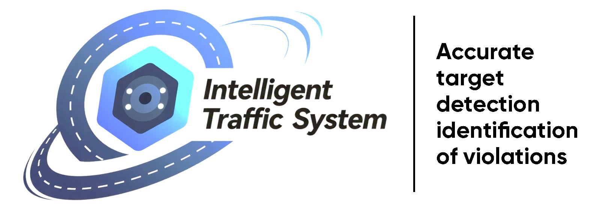
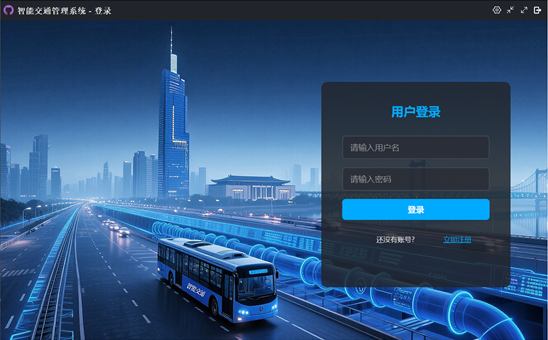
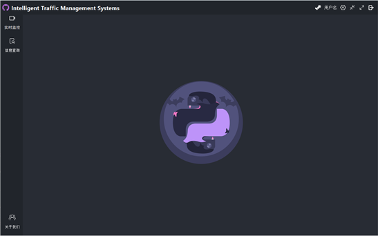
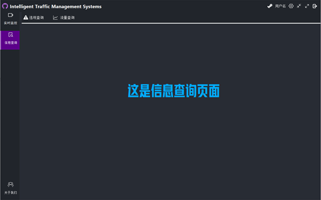
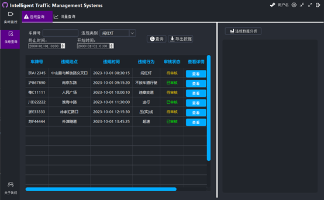
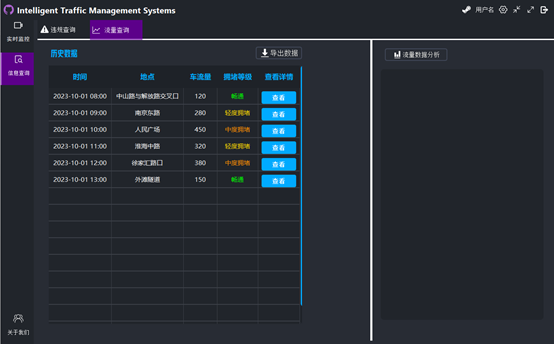

<h1 align="center" style="font-size: 2.5rem; font-weight: bold;">智能交通监控管理系统</h1>
<h2 align="center" style="font-size: 2.5rem; font-weight: bold;">V 1.0</h2>

<p align="center">
  <a href="https://github.com/yihangli1118/Intelligent-Traffic-System.git/">
    
  </a>
  <p align="center">
    <a href="https://github.com/yihangli1118/Intelligent-Traffic-System/blob/master/docs/requirement%20analysis.md">需求分析</a>
    ·
    <a href="https://github.com/yihangli1118/Intelligent-Traffic-System/blob/master/docs/architecture%20design.md">概要设计</a>
    ·
    <a href="https://github.com/yihangli1118/Intelligent-Traffic-System/blob/master/docs/detailed%20design.md">详情设计</a>
  </p>

<p align="center">
  
  
  
</p>
<p align="center">
  
  
  
</p>

## 目录

- [文件目录说明](#文件目录说明)
- [配置安装](#配置安装)
- [项目文档](#项目文档)
- [界面UI](#界面UI)
- [开发的架构](#开发的架构)
- [部署](#部署)
- [使用到的框架](#使用到的框架)
- [贡献者](#贡献者)
  - [如何参与开源项目](#如何参与开源项目)
- [版本控制](#版本控制)
- [作者](#作者)
- [鸣谢](#鸣谢)

## 文件目录说明

```
Intelligent-Traffic-System
├── LICENSE.txt
├── README.md
├── requirements.txt
├── .venv
├── /images/
├── /docs/
│  ├── architecture design.md
│  ├── detailed design.md
│  ├── requirement analysis.md
├── /src/
│  ├── main.py
│  ├── /controllers/
│  ├── /models/
│  ├── /services/
│  ├── /utils/
│  ├── /plateDetect/
│  ├── /targetDetect/
│  ├── /views/

```

## 配置安装

### 克隆项目

```sh
git clone https://github.com/yihangli1118/Intelligent-Traffic-System.git
```

### 创建虚拟环境

```sh
py -3.8 -m venv .venv
```

### 激活虚拟环境

```sh
.venv\Scripts\activate
```

### 安装项目依赖

```sh
pip install torch==1.8.1+cu111 torchvision==0.9.1+cu111 torchaudio==0.8.1 -f https://download.pytorch.org/whl/torch_stable.html
pip install -r requirements.txt
```

### 运行项目

```sh
python main.py
```

### Tips
在运行时若出现下面报错
```sh
qt.qpa.plugin: Could not find the Qt platform plugin "windows" in ""
This application failed to start because no Qt platform plugin could be initialized. Reinstalling the application may fix this problem.
```
原因是运行时找不到Qt的平台插件（platform plugin）

解决方法是在运行程序前，设置`QT_QPA_PLATFORM_PLUGIN_PATH`环境变量，指向Qt插件目录
```sh
$env:QT_QPA_PLATFORM_PLUGIN_PATH = "$pwd\..\.venv\Lib\site-packages\PyQt5\Qt5\plugins"
```

## 项目文档

<p align="center">
    <a href="https://github.com/shaojintian/Best_README_template">需求分析</a>
    ·
    <a href="https://github.com/shaojintian/Best_README_template/issues">概要设计</a>
    ·
    <a href="https://github.com/shaojintian/Best_README_template/issues">详情设计</a>
  </p>

## 界面UI

### **1.登录界面**



### **2.主页面**



### **3.实时监控页面**


### **4.信息查询页面**



### **5.违规查询页面**



### **6.流量查询页面**



### **7.关于我们页面**


## 开发的架构 

请阅读[ARCHITECTURE.md](https://github.com/shaojintian/Best_README_template/blob/master/ARCHITECTURE.md) 查阅为该项目的架构。

## 项目部署

暂无

## 使用到的框架

### 1. 核心框架与技术栈

#### 1.1 服务端框架
| 框架名称       | 版本要求   | 用途说明                     |
|----------------|------------|------------------------------|
| FastAPI        | 0.95+      | RESTful API服务框架           |
| Uvicorn        | 0.22+      | ASGI服务器实现                |
| SQLAlchemy     | 2.0+       | ORM数据库操作框架             |
| Alembic        | 1.10+      | 数据库迁移工具                |
| Celery         | 5.3+       | 分布式任务队列                |
| Redis          | 7.0+       | 缓存与消息代理                |

#### 1.2 AI分析框架
| 框架名称       | 版本要求   | 用途说明                     |
|----------------|------------|------------------------------|
| PyTorch        | 2.0+       | 深度学习训练与推理框架        |
| OpenCV         | 4.8+       | 计算机视觉处理库              |
| ONNX Runtime   | 1.14+      | 模型跨平台部署框架            |
| TensorRT       | 8.6+       | NVIDIA GPU加速推理框架        |
| MMDetection    | 3.0+       | 目标检测算法框架              |

#### 1.3 客户端框架
| 框架名称       | 版本要求   | 用途说明                     |
|----------------|------------|------------------------------|
| PyQt5          | 5.15+      | 桌面应用GUI框架               |
| QtWebEngine    | 5.15+      | 嵌入式浏览器组件              |
| QMaterial      | 1.3+       | Material Design风格组件库     |

#### 1.4 Web前端框架
| 框架名称       | 版本要求   | 用途说明                     |
|----------------|------------|------------------------------|
| Vue.js         | 3.2+       | 前端MVVM框架                 |
| Element Plus   | 2.3+       | UI组件库                     |
| ECharts        | 5.4+       | 数据可视化库                  |
| OpenLayers     | 7.4+       | 地理信息系统地图库            |

### 2. 关键依赖库

#### 2.1 视频处理
```python
ffmpeg-python == 0.2.0+  # 视频流处理
PyAV == 11.0.0+          # 音视频编解码
imutils == 0.5.4+        # 图像处理工具集
```

#### 2.2 数据处理

```
pandas == 2.0.0+         # 结构化数据分析
numpy == 1.24.0+         # 数值计算基础库
polars == 0.18.0+        # 高性能数据帧处理
```

#### 2.3 网络通信

```
httpx == 0.24.0+         # 异步HTTP客户端
websockets == 11.0.0+    # WebSocket通信
pika == 1.3.0+           # RabbitMQ客户端
```

### 3. 开发环境配置

#### 3.1 Python环境

```
conda create -n its python=3.8.10
conda install -c pytorch pytorch torchvision torchaudio
pip install -r requirements.txt
```

#### 3.2 数据库配置

```
# config/database.yaml
mysql:
  host: 127.0.0.1
  port: 3306
  user: its_admin
  password: secure_password
  database: its_platform
```

#### 3.3 AI模型部署

```
# Dockerfile示例
FROM nvidia/cuda:12.2-base
RUN pip install torch-2.0.0+cu118 -f https://download.pytorch.org/whl/torch_stable.html
COPY ./models /app/models
```

### 4. 框架架构图

```
┌─────────────────────────────────────────────────┐
│                  Client (PyQt5)                 │
└───────────────┬─────────────────┬───────────────┘
                │ HTTP/WebSocket  │
┌───────────────▼─────┐   ┌───────▼───────────────┐
│   FastAPI Server    │   │    Web Frontend       │
│ ┌─────────────────┐ │   │ (Vue.js + Element Plus)│
│ │    REST API     │ │   └──────────┬────────────┘
│ └────────┬────────┘ │              │
│          │          │              │
│ ┌────────▼────────┐ │   ┌──────────▼────────────┐
│ │   Celery Worker  │ │   │      Redis Cache      │
│ └────────┬────────┘ │   └──────────┬────────────┘
│          │          │              │
│ ┌────────▼────────┐ │   ┌──────────▼────────────┐
│ │  AI Inference   │ │   │    MySQL Database     │
│ │ (PyTorch/TRT)   │ │   └──────────────────────┘
│ └─────────────────┘ │
└──────────────────────┘
```

### 5. 扩展接口

| 接口类型   | 协议标准       | 用途说明         |
| ---------- | -------------- | ---------------- |
| 视频流接入 | RTSP/ONVIF     | 摄像头设备接入   |
| 数据交换   | HTTPS/REST     | 与交警平台对接   |
| 消息推送   | WebSocket/MQTT | 实时事件通知     |
| 地图服务   | WMS/TMS        | 地理信息数据服务 |

## 贡献者

请阅读**CONTRIBUTING.md** 查阅为该项目做出贡献的开发者。

## 如何参与开源项目

贡献使开源社区成为一个学习、激励和创造的绝佳场所。你所作的任何贡献都是**非常感谢**的。


1. Fork the Project
2. Create your Feature Branch (`git checkout -b feature/AmazingFeature`)
3. Commit your Changes (`git commit -m 'Add some AmazingFeature'`)
4. Push to the Branch (`git push origin feature/AmazingFeature`)
5. Open a Pull Request


## 版本控制

该项目使用Git进行版本管理。您可以在repository参看当前可用版本。

## 作者

xxx@xxxx

知乎:xxxx  &ensp; qq:xxxxxx    

 *您也可以在贡献者名单中参看所有参与该项目的开发者。*

## 版权说明

该项目签署了MIT 授权许可，详情请参阅 [LICENSE.txt](https://github.com/shaojintian/Best_README_template/blob/master/LICENSE.txt)

## 鸣谢


- [GitHub Emoji Cheat Sheet](https://www.webpagefx.com/tools/emoji-cheat-sheet)
- [Img Shields](https://shields.io)
- [Choose an Open Source License](https://choosealicense.com)
- [GitHub Pages](https://pages.github.com)
- [Animate.css](https://daneden.github.io/animate.css)

<!-- links -->

[your-project-path]:shaojintian/Best_README_template
[contributors-shield]: https://img.shields.io/github/contributors/shaojintian/Best_README_template.svg?style=flat-square
[contributors-url]: https://github.com/shaojintian/Best_README_template/graphs/contributors
[forks-shield]: https://img.shields.io/github/forks/shaojintian/Best_README_template.svg?style=flat-square
[forks-url]: https://github.com/shaojintian/Best_README_template/network/members
[stars-shield]: https://img.shields.io/github/stars/shaojintian/Best_README_template.svg?style=flat-square
[stars-url]: https://github.com/shaojintian/Best_README_template/stargazers
[issues-shield]: https://img.shields.io/github/issues/shaojintian/Best_README_template.svg?style=flat-square
[issues-url]: https://img.shields.io/github/issues/shaojintian/Best_README_template.svg
[license-shield]: https://img.shields.io/github/license/shaojintian/Best_README_template.svg?style=flat-square
[license-url]: https://github.com/shaojintian/Best_README_template/blob/master/LICENSE.txt
[linkedin-shield]: https://img.shields.io/badge/-LinkedIn-black.svg?style=flat-square&logo=linkedin&colorB=555
[linkedin-url]: https://linkedin.com/in/shaojintian


