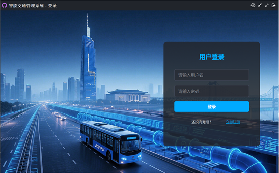
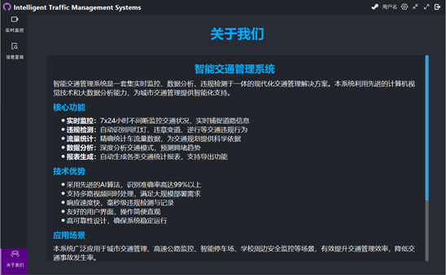

<h1 style="border-bottom: 2px solid #1a5276; padding-bottom: 10px;">智能交通监控管理系统</h1>

<h3 style="color: #2e86c1;">概要设计</h3>

版本：V1.0 | 日期：2025年09月05日

**版本历史**

|     |     |     |     |     |
| --- | --- | --- | --- | --- |
| 版本/状态 | 作者  | 参与者 | 日期  | 备注  |
| 1.0.0 | 【智能交通监控管理系统】项目组 |     | 2025-08-27 | 创建  |

**目   录**

[一、编写目的 7](#_Toc_1)

[二、读者对象 7](#_Toc_3)

[三、术语与缩写解释 7](#_Toc_5)

[四、参考资料 11](#_Toc_23)

[一、项目描述 12](#_Toc_25)

[二、项目功能描述 12](#_Toc_27)

[一、需求约束 20](#_Toc_55)

[二、隐含约束 21](#_Toc_67)

[一、安全设计 23](#_Toc_69)

[二、MAP平台相关业务流程 23](#_Toc_71)

[三、业务功能概要结构 26](#_Toc_83)

[四、模块定义 33](#_Toc_125)

[一、E-R实体结构图 36](#_Toc_127)

[二、实体描述 36](#_Toc_129)

[一、MAP平台逻辑架构设计 49](#_Toc_175)

[二.物理架构设计 50](#_Toc_185)

[三.技术架构设计 50](#_Toc_187)

[一、桌面布局设计 53](#_Toc_195)

[二、业务界面风格展示 53](#_Toc_201)

[一、运行环境 54](#_Toc_205)

[二、系统性能要求 54](#_Toc_213)

&nbsp;

# 第一部分 引言一、编写目的

编写本文的主要目的是把需求分析得到的用例模型转换为软件结构和数据结构。设计软件结构的具体任务是：将一个复杂系统按功能进行模块划分、建立模块的层次结构及调用关系、确定模块间的接口及人机界面等。数据结构设计包括数据特征的描述、确定数据的结构特性、以及数据库的设计。

本设计是指导详细设计和项目实施的重要指导性文件，也是进行系统集成测试和重要依据。

# 二、读者对象

该文档的读者为用户代表、软件分析人员、开发管理人员和测试人员。

# 三、术语与缩写解释

## 1.ITS

ITS是智能交通系统（Intelligent Transportation System）的缩写。它通过先进的传感、通信、控制和信息处理技术，对交通流进行实时监测、分析和管理，旨在全面提升交通运输系统的效率、安全性和可持续性。智能交通监控管理系统是其核心组成部分之一。

## 2.CV

CV是计算机视觉（Computer Vision）的缩写，是人工智能的一个分支。它旨在通过计算机和相机来模拟人类视觉系统，实现对图像和视频的自动理解、分析和决策。它是智能交通监控中实现车辆检测、车牌识别和行为分析的核心技术基础。

## 3.CNN

CNN是卷积神经网络（Convolutional Neural Network）的缩写，是一种专为处理网格状数据（如图像）而设计的深度前馈神经网络。其核心的卷积层和池化层能高效提取图像的局部特征（如边缘、纹理），广泛应用于图像分类、目标检测和车牌识别等任务。

## 4.LPR

LPR是车牌识别（License Plate Recognition）的缩写，有时也称为ANPR（自动车牌识别）。它是一种利用计算机视觉和图像处理技术，自动从车辆图像或视频流中检测车牌位置、分割字符并识别出车牌文本的技术。是智能交通系统中进行车辆身份认证的关键环节。

## 5.YOLO

YOLO（You Only Look Once）是一种先进的一阶段（one-stage）目标检测算法。其核心思想是将目标检测任务视为一个单一的回归问题，直接在图像上预测边界框和类别概率。以其极高的处理速度著称，非常适合智能交通监控中对实时性要求极高的场景。

## 6.FPS

FPS是帧率（Frames Per Second）的缩写，表示每秒处理的图像帧数。它是衡量智能交通监控系统实时性能的关键指标。更高的FPS意味着系统能更流畅地处理视频流，减少延迟，从而更及时地捕获交通事件。

## 7.AI

AI是人工智能（Artificial Intelligence）的缩写，是研究、开发用于模拟、延伸和扩展人的智能的理论、方法、技术及应用系统的一门新的技术科学。其在智能交通领域旨在让机器能够胜任一些通常需要人类智能才能完成的复杂交通管理任务，如判断车辆行为是否违章、预测交通流量趋势、优化信号灯配时等。本系统主要运用其下的机器学习和深度学习技术，通过算法模型从历史数据中学习规律，并对实时交通数据进行智能研判。

## 8.RTSP

RTSP是实时流传输协议（Real Time Streaming Protocol）的缩写，是一种网络应用协议，专为娱乐和通信系统控制流媒体服务器而设计。该协议允许客户端通过发送诸如播放、暂停、录制等指令，来远程控制来自摄像头的实时音视频流。在智能交通监控系统中，绝大多数网络摄像头（IPC）都支持RTSP协议，系统通过拉取摄像头的RTSP流地址来获取实时的视频数据，并将其作为AI算法分析的原始数据源。

## 9.API

API是应用程序编程接口（Application Programming Interface）的缩写，是一些预先定义的函数或软件系统不同组成部分衔接的约定。在智能交通监控系统中，API被广泛用于内部模块间及与外部系统（如“公安交通管理综合应用平台”，俗称“六合一平台”）的数据交换和功能调用。例如，系统通过内部API将识别到的违章数据传递给审核模块，审核通过后，再通过标准数据接口API将结构化数据推送至交警业务系统，完成非现场执法的闭环管理。

## 10.HTTPS

HTTPS是超文本传输安全协议（Hypertext Transfer Protocol Secure）的缩写。它是一种通过计算机网络进行安全通信的传输协议。HTTPS经由HTTP进行通信，但利用SSL/TLS来对数据包进行加密和保护。HTTPS开发的主要目的是提供对网站服务器的身份认证，保护交换数据的隐私与完整性。在智能交通监控系统中，HTTPS协议被广泛应用于管理客户端与服务器之间的所有Web通信，确保用户登录凭证、系统配置信息、报警数据等敏感信息在传输过程中不会被窃听或篡改，是系统通信安全的重要基石。

## 11.IPC

IPC是网络摄像机（Internet Protocol Camera）的缩写，通常也称为网络摄像头。它是一种集成了图像采集、信号处理和网络传输功能的嵌入式设备，能够通过IP网络（如局域网或互联网）传输视频数据。与传统的模拟摄像机不同，IPC内置Web服务器、图像传感器和编码芯片，可直接输出数字视频信号，并支持通过RTSP标准协议进行访问和控制。在智能交通监控系统中，IPC是部署在路口、路段等监控点的最前端的核心感知设备，负责采集高质量的实时视频流，为后续的车辆检测、车牌识别、行为分析等AI算法提供原始数据源。

## 12.GPU

GPU是图形处理器（Graphics Processing Unit）的缩写，是一种专门设计用于快速处理和渲染图像、图形的微处理器。与通用计算的中央处理器（CPU）不同，GPU采用高度并行的架构，拥有成千上万个小型、高效的核心，能够同时处理大量相似的计算任务。GPU是部署在服务器或边缘计算设备中的核心计算单元，负责进行大规模的并行计算，为视频解码、图像处理和深度学习推理等计算密集型任务提供强大的加速能力。

## 13.B/S

B/S是浏览器/服务器结构（Browser/Server）的缩写。它是随着Internet技术的兴起，对C/S结构的一种变化和改进。在这种结构下，用户工作界面是通过WWW浏览器来实现，极少部分事务逻辑在前端（Browser）实现，但是主要事务逻辑在服务器端（Server）实现。在智能交通监控系统中，指挥中心大屏、后台管理平台等均采用B/S架构，用户无需安装任何专门的客户端软件，只需通过浏览器即可访问系统全部功能，极大地简化了系统的部署、维护和升级。

# 四、参考资料

《&lt;智能交通监控管理系统&gt;项目需求说明书》

# 第二部分 项目概述一、项目描述

随着智能交通的发展以及视频监控、人工智能识别等技术的不断成熟，城市道路交通管理对信息化和智能化的需求也日益增强，如在交通执法过程中如何实时发现并上报违规行为，在指挥调度中如何快速检索车辆信息，在交通治理中如何进行数据统计与趋势分析等。为满足交管部门高效执法和科学决策的需要，结合项目实际应用场景，团队自主研发了智能交通监控管理平台，通过统一的系统架构，实现了违规行为识别预警、证据管理、车辆与类别查询、数据统计分析等功能。

# 二、项目功能描述

用户业务主要包含实时监控与信息查询。

实时监控包含两个主要业务：实时违规查看、实时流量查看。

信息查询包含七个主要业务查询：违规查询、违规审核、按车牌查询、按违规类别查询、违规数据统计分析、流量查询、流量数据统计分析。

## 1.实时违规查看

实时违规查看模块主要为交管部门用户提供实时交通违规事件的滚动展示。

实时违规信息包括：

1）违规发生时间，格式为yyyy-MM-dd hh:mm:ss

2）违规发生地点，精确到具体路口/路段及车道

3）违规类别，如闯红灯、压线、不礼让行人、肇事逃逸

4）违规车辆基础信息，包括，车牌号码、车牌颜色、车型、车身颜色

## **2.实时流量查看**

实时流量查看主要为交管部门用户提供当前路口/路段的实时交通流量数据展示及拥堵状态动态监测。

实时流量信息包括：

1）实时瞬时车流量

2）实时交通拥堵指数，采用0-10分级制表示，包括0-2级畅通、3-4级基本畅通、5-6级轻度拥堵、7-8级中度拥堵、9-10级严重拥堵

实时车流量表示的是当前时刻的车流量。

交通拥堵指数采用滑动条展示，设置滑动指示器，实时标注当前道路的拥堵指数位置，直观反映交通运行状态。

## 3.违规查询

违规查询主要是对道路监控系统识别到的车辆违规信息进行查询，交管部门可以根据查询结果进行处置或制定管理策略。违规查询以表格的形式展示，可滚动可换页。

违规信息包括：

1）违规发生时间，格式为yyyy-MM-dd hh:mm:ss

2）违规发生地点，精确到具体路口/路段及车道

3）违规类别，如闯红灯、压线、不礼让行人、肇事逃逸

4）违规车辆基础信息，包括，车牌号码、车牌颜色、车型、车身颜色

5）处罚结果，如罚款、行政拘留、吊销驾驶证

6）审核状态，分为已审核和未审核两种状态

## **4.违规审核**

违规审核主要是对监控系统识别出的车辆违规记录进行人工审核，确保违规证据真实有效，并决定处罚结果以及是否立案处理。

违规审核是通过点击违规查询页面中的审核状态显示的，每次显示一条违规记录的审核信息。

违规审核页面显示的信息包含：

1）违规发生时间，格式为yyyy-MM-dd hh:mm:ss

2）违规发生地点，精确到具体路口/路段及车道

3）违规类别，如闯红灯、压线、不礼让行人、肇事逃逸

4）违规车辆基础信息，包括，车牌号码、车牌颜色、车型、车身颜色

5）违规时的照片及视频

5）处罚结果，如罚款、行政拘留、吊销驾驶证

交管部门可以选择要进行的操作，如进行的操作，包括修改、驳回和确认。如果系统识别的违规信息有误或需要补充，交管部门选择“修改”，对违规类别、违规车辆信息、处罚结果等进行修改，随后选择“确认”；如果系统错判，交管部门选择“驳回”并填写驳回原因，取消本条违规信息；如果系统判断无误，交管部门选择“确认”。审核通过的记录将提交至处罚系统，交管部门可进一步将违规信息和处罚结果发送给车主。

## 5.按车牌查询

按车牌查询主要是通过输入或选择车辆号牌，检索监控系统中该车辆的所有相关违规记录。

查询条件选择页面包含以下条目：

1）车牌号输入

2）起始时间和结束时间（可选）

车牌号输入支持精确输入和模糊匹配，支持大小写自动识别，可输入完整的车牌号、车牌前缀或部分字符。

时间日期要使用选单进行选取。

点击查询后会显示查询结果，以表格形式展示，包含时间、地点、车牌号、违规类型等信息。点击某条记录可进入详情页面，查看监控截图或视频证据。

## 6.按违规类别查询

按违规类别查询就是通过选择特定的违规类型，检索系统中所有属于该类别的相关违规记录。

查询条件选择页面包含以下条目：

1）违规类别选择

2）起始时间和结束时间（可选）

违规类别支持输入和下拉选择，支持单选或多选，如闯红灯、压线、不礼让行人、肇事逃逸等。

时间日期要使用选单进行选取。

点击查询后会显示查询结果，以表格形式展示，包含时间、地点、车牌号、违规类型等信息。点击某条记录可进入详情页面，查看对应的监控截图或视频证据。

## 7.违规数据统计分析

违规数据统计是对采集到的各类交通违法记录进行分类汇总与多维度分析。通过数据可视化展示趋势变化与热点分布，辅助交管部门识别高发时段、重点路口和高风险车辆，从而为交通管理决策和政策制定提供数据支撑。

主要功能包括：

1）统计汇总：对违规数量、涉及车辆类型等进行分类汇总。

2）趋势分析：按小时/日/周/月等时间维度展现违规发生趋势。

3）空间分析：按路口、道路或区域统计违规发生频次，生成热力图。

4）类型分析：对闯红灯、超速、逆行等不同违规行为进行占比统计。

5）报表输出：支持导出 Excel、PDF格式的统计报表，用于日常工作汇报。

## **8.流量查询**

流量查询模块主要为交管部门用户提供路段历史车流量数据的完整展示，每5秒记录更新一次。

查询条件选择页面包含以下条目：

1）起始时间和结束时间

点击查询后会显示查询结果，历史流量信息以表格形式展示，包含：

1）时间戳信息，格式为yyyy-MM-dd hh:mm:ss

2）当前路段/路口瞬时历史车流量

## **9.流量数据统计分析**

流量数据统计分析主要为交管部门用户提供历史流量数据的多维度统计计算、可视化图表展示及规律分析服务。

统计分析信息包括：

1）时段流量趋势折线图，支持按小时/日/周/月查询

2）时段流量占比饼图，呈现日级/周级/月级统计周期内，各细分时段流量占总流量的比例

3）高峰时段识别柱状图

4）同期流量对比双折线图，支持按小时/日/周/月查询

5）规律分析建议

# 第三部分 设计约束一、需求约束

## 1.本系统应当遵循的技术标准

数据命名、代码格式及架构设计应遵循《PEP 8》及Qt官方的人机交互指中的相关规定。

视频流处理与编解码需遵循行业标准协议（如 RTSP）确保与流监控摄像设备的兼容性。

## 2.软、硬件环境标准

本系统采用B/S架构。采用Python语言编写，数据库采用MySQL。系统部署在Linux（Ubuntu Server 20.04 LTS 或 CentOS Stream 9）操作系统。

管理客户端采用Python语言编写，基于PyQt5框架开发，可部署于Windows 10专业版（64 位）或Ubuntu Desktop 22.04 LTS操作系统。

## 3.接口/协议标准

系统通过HTTPS协议实现移动终端与服务器之间的业务数据通信。

系统通过标准流媒体RTSP协议实现视频流处理与编解码。

## 4.用户界面标准

管理客户端界面采用PyQt5进行开发，界面设计应遵循桌面应用设计规范。

## 5.软件质量

1）正确性

系统必须能够准确识别车辆牌照、车型等信息，且所有抓拍记录、违章处理、数据统计等核心交易业务必须被正确处理。

2）健壮性

系统核心服务（如车牌识别、数据存储）应能够实现7\*24小时无故障运行，同时系统应具备良好的容错能力，单个摄像设备或服务器节点故障不应导致整个系统瘫痪。

3）效率性

系统从车辆触发抓拍到完成识别、记录入库，整体延时不超过3秒钟。

系统应能支持多路视频流并发接入与处理。

Web管理后台在同时进行多条件复合查询时，响应时间不应超过5秒钟。

4）易用性

界面图形化采用图形化、向导式的操作方式，功能菜单清晰明了。

5）安全性

所有用户密码均需密文存储，报文中的敏感数据需进行加密传输。

系统应记录详细的操作审计日志，追踪所有关键操作的执行人、时间和内容。

6）可扩展性

系统应采用前后端分离和模块化设计，后端API应保持接口规范稳定。

7）网络体系结构

注：网络结构说明

1）前端采集单元

部署在各路口的网络摄像头（IPC），负责采集视频流并进行初步的边缘计算分析。

2）网络传输域

连接前端与数据中心的网络，包括公安专网、光纤网络等。

3）交管业务网

系统核心服务部署的区域，包含：AI分析服务器集群，用于承载深度学习模型，进行大规模的实时视频智能分析；应用与数据库服务器，用于运行业务逻辑，处理并存储识别结果、用户信息、配置信息等；流媒体服务器,用于负责视频流的转发、分发与录制。

4）指挥中心客户端

指挥中心民警使用的监控与管理计算机。

# 二、隐含约束

用户具有基本的业务技能和基本的电脑知识，对我们提供的操作界面应保证他们经过简单培训后无障碍的操作。

软件可以流畅运行在Windows 10版本以上的设备中。

应该把有可能变动的参数存放到配置文件或数据库中，保证修改参数的灵活性。

# 第四部分 ITS系统方案设计一、安全设计二、ITS系统相关业务流程

## 1.用户登录流程

说明：

交管部门向智能交通监控平台发起登录请求。

智能交通监控平台接收请求，会将登录信息发给认证服务。

认证服务将把校验结果（成功或失败）返回至智能交通监控平台。

智能交通监控平台依据认证服务校验结果，向交管部门用户做出不同响应。

## 2.实时监控查看流程

说明：

交管部门向智能交通监控平台发起实时监控查看请求。

智能交通监控平台接收请求，会向监控服务发起请求。

监控服务返回实时监控至智能交通监控平台，并向数据库查询违规记录与流量数据。

数据库返回至智能交通监控平台。

智能交通监控平台向交管部门展示。

## 3.违规查询流程

说明：

交管部门向智能交通监控平台发起信息查询、违规查询请求。

智能交通监控平台接收请求，会向违规服务发起请求。

违规服务向数据库按条件查询违规记录。

数据库返回至违规服务。

违规服务封装数据后返回智能交通监控平台。

智能交通监控平台向交管部门展示。

交管部门向智能交通监控服务发起查看详情、审核请求。

智能交通监控平台转发修改请求至违规服务。

违规服务向数据库发起修改数据的请求。

数据库修改数据后返回修改结果。

违规服务封装后返回智能交通监控平台。

智能交通监控平台向交管部门展示。

## 4.流量查询流程

说明：

交管部门向智能交通监控平台发起信息查询、流量查询请求。

智能交通监控平台接收请求，会向流量服务发起请求。

流量服务向数据库查询流量数据统计。

数据库返回至流量服务封装数据至智能交通监控平台。

智能交通监控平台向交管部门展示。

# 三、业务功能概要结构 

## 1.用户登录模块

### 1.1 用户注册

1）初始化注册界面

2）用户输入用户名、密码等注册信息

3）系统接收信息数据

4）系统将数据发送至服务器

### 1.2 登录验证

1）初始化登录界面

2）用户输入用户名、密码等信息

3）系统使用用户名密码等信息向服务器发送登录请求

4）服务器返回登录结果

5）如果登录成功，初始化主界面；否则提示登陆失败

## 2.实时监控查看模块

### 2.1 实时违规查看

1）初始化实时违规界面

2）系统向服务器发送违规查看请求

3）系统接收违规事件数据流

4）系统实时显示违规数据

5）系统实时刷新事件列表

### 2.2 实时流量查看

1）初始化实时流量界面

2）系统向服务器发送流量查看请求

3）系统接收交通流量数据流

4）系统处理交通流量数据并显示

5）系统实时刷新流量数据

## 3.信息查询模块

&nbsp;

### 3.1 违规查询

1）初始化违规查询功能界面

2）系统向服务器发送违规查询请求

3）系统接收违规事件数据流

4）系统显示违规记录列表

5）用户可交互点击查看特定违规事件详情信息

### 3.2 违规审核

1）用户选择特定事件查看违规详情

2）系统向服务器发送违规查询请求

3）系统接收该违规记录的相关证据

4）系统显示违规详情和证据材料

5）用户可交互选择修改该事件记录

6）系统向服务器发送修改请求

7）显示修改成功提示

### 3.3 按车牌查询

1）初始化违规查询功能界面

2）用户通过车牌号进行查询

3）系统将车牌号发送至服务器

3）系统接收符合条件的违规事件数据流

4）系统显示符合条件的违规记录列表

5）用户可交互点击查看特定违规事件详情信息

### 3.4 按违规类别查询

1）初始化违规查询功能界面

2）用户通过输入违规类别进行查询

3）系统将违规类别发送至服务器

3）系统接收符合条件的违规事件数据流

4）系统显示符合条件的违规记录列表

5）用户可交互点击查看特定违规事件详情信息

### 3.5 违规数据统计分析

1）初始化违规查询功能界面

2）系统向服务器发送统计分析请求

3）服务器执行数据统计与分析操作

4）系统接受服务器返回的结构化数据

5）系统将数据可视化并显示

### 3.6 流量查询

1）初始化流量查询功能界面

2）系统发起历史车流量数据请求

3）系统接收车流量数据流

4）系统显示历史车流量数据

### 3.7 流量数据统计分析

1）初始化流量查询功能界面

2）系统向服务器发送统计分析请求

3）服务器执行数据统计与分析操作

4）系统接受服务器返回的结构化数据

5）系统将数据可视化并显示

# 四、模块定义

|     |     |     |
| --- | --- | --- |
| 模块  | 组件  | 规格/型号 |
| 用户登录 | 用户注册 | 存储用户注册信息 |
|     | 登录验证 | 根据用户账户密码列表验证登录信息 |
| 实时监控 | 实时违规查看 | 滚动展示实时交通违规事件 |
|     | 实时流量查看 | 实时展示交通流量数据及交通拥堵指数 |
| 信息查询 | 违规查询 | 查询道路监控系统识别到的车辆违规信息 |
|     | 违规审核 | 人工审核监控系统识别出的车辆违规记录 |
|     | 按车牌查询 | 检索监控系统中该车辆的所有相关违规记录 |
|     | 按违规类别查询 | 按照特定的违规类型，检索系统中所有属于该类别的相关违规记录 |
|     | 违规数据统计分析 | 对各类交通违法记录进行分类汇总与多维度分析 |
|     | 流量查询 | 展示历史车流量数据 |
|     | 流量数据统计分析 | 对历史车流量数据进行可视化图表统计分析 |

&nbsp;

# 第五部分 E-R实体设计一、E-R实体结构图

# 二、实体描述

## **1.User实体描述**

|     |     |     |     |
| --- | --- | --- | --- |
| **编号** | **英文名** | **中文名** | **数据类型** |
| 1   | UserId | 用户id | str |
| 2   | Password | 用户密码 | str |
| 3   | UserName | 用户账号 | str |

## **2.Vehicle实体描述**

|     |     |     |     |
| --- | --- | --- | --- |
| **编号** | **英文名** | **中文名** | **数据类型** |
| 1   | PlateNumber | 车牌号 | str |
| 2   | PlateColor | 车牌颜色 | str |
| 3   | VehicleType | 车型  | str |
| 4   | BodyColor | 车身颜色 | str |
| 5   | Speed | 车速  | float |
| 6   | driving_direction | 行驶方向 | int |

## **3.Pedestrian实体描述**

|     |     |     |     |
| --- | --- | --- | --- |
| **编号** | **英文名** | **中文名** | **数据类型** |
| 1   | PedestrianId | 行人id | int |

## **4.NonMotorVehicle实体描述**

|     |     |     |     |
| --- | --- | --- | --- |
| **编号** | **英文名** | **中文名** | **数据类型** |
| 1   | NonMotorId | 非机动车id | int |

## **5.TrafficFlow实体描述**

|     |     |     |     |
| --- | --- | --- | --- |
| **编号** | **英文名** | **中文名** | **数据类型** |
| 1   | VehicleCount | 车数  | int |
| 2   | StatTime | 统计时间 | datetime |
| 3   | RoadId | 路口id | str |

## **6.Road实体描述**

|     |     |     |     |
| --- | --- | --- | --- |
| **编号** | **英文名** | **中文名** | **数据类型** |
| 1   | RoadId | 路口 id | int |
| 2   | TrafficLightId | 信号灯 | dict |
| 3   | VehicleInfo | 车辆  | list\[dict\] |
| 4   | PedestrianInfo | 行人  | list\[dict\] |
| 5   | NonMotorInfo | 非机动车 | list\[dict\] |
| 6   | CurrentFlow | 车流量 | dict |
| 7   | CongestionIndex | 交通拥堵指数 | int |

## **7.TrafficLight​实体描述**

|     |     |     |     |
| --- | --- | --- | --- |
| **编号** | **英文名** | **中文名** | **数据类型** |
| 1   | LightId | 信号灯id | int |
| 2   | LeftTurnSignal | 左转信号 | int |
| 3   | StraightSignal | 直行信号 | int |
| 4   | RightTurnSignal | 右转信号 | int |

## **8.ViolationEvent实体描述**

|     |     |     |     |
| --- | --- | --- | --- |
| **编号** | **英文名** | **中文名** | **数据类型** |
| 1   | ViolationId | 违规记录id | int |
| 2   | OccurTime | 违规时间 | datetime |
| 3   | RoadId | 路口id | str |
| 4   | VehicleId | 违规车辆 | str |
| 5   | ViolationType | 违规类别 | str |
| 6   | ReviewStatus | 审核状态 | int |

## **9.**LineCrossingViolation**实体描述**

|     |     |     |     |
| --- | --- | --- | --- |
| **编号** | **英文名** | **中文名** | **数据类型** |
| 1   | ViolationId | 违规记录id | int |
| 2   | OccurTime | 违规时间 | datetime |
| 3   | RoadId | 路口id | str |
| 4   | VehicleId | 违规车辆 | str |
| 5   | ViolationType | 违规类别 | str |
| 6   | ReviewStatus | 审核状态 | int |

## **10.**RedLightRunningViolation**实体描述**

|     |     |     |     |
| --- | --- | --- | --- |
| **编号** | **英文名** | **中文名** | **数据类型** |
| 1   | ViolationId | 违规记录id | int |
| 2   | OccurTime | 违规时间 | datetime |
| 3   | RoadId | 路口id | str |
| 4   | VehicleId | 违规车辆 | str |
| 5   | ViolationType | 违规类别 | str |
| 6   | ReviewStatus | 审核状态 | int |

## **11.**LaneViolation**实体描述**

|     |     |     |     |
| --- | --- | --- | --- |
| **编号** | **英文名** | **中文名** | **数据类型** |
| 1   | ViolationId | 违规记录id | int |
| 2   | OccurTime | 违规时间 | datetime |
| 3   | RoadId | 路口id | str |
| 4   | VehicleId | 违规车辆 | str |
| 5   | ViolationType | 违规类别 | str |
| 6   | ReviewStatus | 审核状态 | int |

## **12.**IllegalLaneChangeViolation**实体描述**

|     |     |     |     |
| --- | --- | --- | --- |
| **编号** | **英文名** | **中文名** | **数据类型** |
| 1   | ViolationId | 违规记录id | int |
| 2   | OccurTime | 违规时间 | datetime |
| 3   | RoadId | 路口id | str |
| 4   | VehicleId | 违规车辆 | str |
| 5   | ViolationType | 违规类别 | str |
| 6   | ReviewStatus | 审核状态 | int |

## **13.**ReverseDrivingViolation**实体描述**

|     |     |     |     |
| --- | --- | --- | --- |
| **编号** | **英文名** | **中文名** | **数据类型** |
| 1   | ViolationId | 违规记录id | int |
| 2   | OccurTime | 违规时间 | datetime |
| 3   | RoadId | 路口id | str |
| 4   | VehicleId | 违规车辆 | str |
| 5   | ViolationType | 违规类别 | str |
| 6   | ReviewStatus | 审核状态 | int |

## **14.**SpeedingViolation**实体描述**

|     |     |     |     |
| --- | --- | --- | --- |
| **编号** | **英文名** | **中文名** | **数据类型** |
| 1   | ViolationId | 违规记录id | int |
| 2   | OccurTime | 违规时间 | datetime |
| 3   | RoadId | 路口id | str |
| 4   | VehicleId | 违规车辆 | str |
| 5   | ViolationType | 违规类别 | str |
| 6   | ReviewStatus | 审核状态 | int |

## **15.**HitAndRunViolation**实体描述**

|     |     |     |     |
| --- | --- | --- | --- |
| **编号** | **英文名** | **中文名** | **数据类型** |
| 1   | ViolationId | 违规记录id | int |
| 2   | OccurTime | 违规时间 | datetime |
| 3   | RoadId | 路口id | str |
| 4   | VehicleId | 违规车辆 | str |
| 5   | ViolationType | 违规类别 | str |
| 6   | ReviewStatus | 审核状态 | int |

## **16.**PedestrianHitViolation**实体描述**

|     |     |     |     |
| --- | --- | --- | --- |
| **编号** | **英文名** | **中文名** | **数据类型** |
| 1   | ViolationId | 违规记录id | int |
| 2   | OccurTime | 违规时间 | datetime |
| 3   | RoadId | 路口id | str |
| 4   | VehicleId | 违规车辆 | str |
| 5   | ViolationType | 违规类别 | str |
| 6   | ReviewStatus | 审核状态 | int |

# 第六部分 总体设计一、ITS系统逻辑架构设计

## 1.成熟的微服务与分层架构

从平台化与集成化的角度出发，采用分层微服务架构的技术方案与构件化的开发模式。应用功能的实现建立在视频接入、AI分析、数据管理等独立微服务的基础上。通过Python语言体系与API标准，将所有的服务部署在统一的运行时环境中，实现与操作系统的无关性，保证了系统的跨平台性、高扩展性和安全性。各层之间通过明确的接口进行通信，下层为上层提供服务，上层无需关心下层的具体实现细节。

## 2.专业的B/S结构

采用B/S架构。用户通过浏览器即可访问系统，无需安装任何客户端，极大提高了信息展示的灵活性与部署的便捷性。

## 3.定制化的服务治理与流程编排

核心服务层的所有功能单元（微服务）均具备“注册、发现、健康监测、负载均衡、熔断”等治理状态，通过API网关统一对外提供服务。主要的业务流程（如“视频分析->事件生成->告警推送->人工处置”）通过JSON格式的配置文件进行描述和编排，实现了业务逻辑的灵活可配。所有外部数据交换（如与上级交警平台对接）均通过标准的API接口并采用JSON数据格式进行描述和实现，确保了系统的开放性和可集成性。

## 4.响应式Web前端应用

在终端网站，通过公安专网/4G/5G等联网技术，便于交警方便、快捷、实时地处理交通事件与查询信息。

# 二、物理架构设计

1）服务端

系统服务端可以部署到云平台上，客户通过浏览器实现管理操作。

2）具体应用

系统服务端可以部署到云平台上，接入移动智能终端的访问。

3）客户端

系统采用B/S模式，用户可通过浏览器访问系统。

4）智能终端

系统提供标准化的集成接口。外部系统可通过Web API标准协议与平台进行数据传输和信息通信。

# 三、技术架构设计

## 1.MVC模型设计

系统采用经典的MVC（Model-View-Controller）架构模式，并将其应用于整个Web前后端的设计中，以实现关注点分离，增强代码的可维护性和可扩展性。

1) Controller层

控制器是模型与视图之间的桥梁，负责处理业务逻辑、用户输入，并调用相应的模型和视图。

AI分析控制器，用于接收来自前端的视频分析请求或定时触发任务，调用后端的AI分析服务（Model）对视频流进行处理，并将分析结果（如识别出的车辆、违章事件）返回。

事件处理控制器，用于接收用户对告警事件的处置指令（如确认、忽略、派发），更新事件的状态，最终将处理结果持久化到模型。

数据查询控制器，用于处理用户的数据统计、历史查询等请求，从模型层获取数据并封装返回给视图层进行展示。

2) View层

视图是用户看到的并与之交互的界面，负责数据的展示和用户操作的捕获。

交通监控大屏，面向指挥中心，以电子地图、图表、指标卡等形式，集中、直观地展示全局交通状态（拥堵指数、实时流量）、关键视频画面和重大告警事件。

Web前端网页，面向日常操作人员，提供功能菜单、数据表格、表单、查询条件框等丰富的UI组件，用于完成违章审核、设备管理、用户管理等具体业务操作。用户在此层的任何操作（点击、查询、提交）都会转化为一个向控制器的请求。

3) Model层

模型代表企业的数据和业务规则，负责数据的存储、获取、处理和状态变化。它是与数据库和AI服务直接交互的一层。

交通状态数据模型，用于封装与交通流相关的数据操作，如从数据库查询历史车流量、平均车速，或从实时计算引擎获取当前的拥堵指数。

事件数据模型，用于封装与交通事件相关的数据操作，如存储新产生的违章记录、更新事件处置状态、查询历史事件等。

## 2.Windows/Ubuntu的Model，Controller，View相互通讯规则 

1）Controller(或ViewModel)可以直接和Model通信。

2）Controller(或ViewModel)也可以直接和View通信（例如通过数据绑定或直接调用）。

3）Model和View永远不能直接通信，以实现关注点分离。

4）在Windows WPF或Ubuntu GTK/Qt等框架中，View和Controller/ViewModel的通信通常是通过数据绑定(Data Binding)、命令(Commands)和事件(Events)实现的。

5）View使用事件(Events)或信号(Signals)向Controller或ViewModel同步用户交互信息。

6）View通过数据绑定(Data Binding)或专门的数据提供接口从Controller/ViewModel处获取显示所需的数据。

7）View的事件处理者和数据上下文通常就是它的Controller或ViewModel。

8）Controller或ViewModel负责从Model获取原始数据，并将其翻译和格式化为View可以直接显示的数据形式。

9）Model通常使用观察者模式(Observer Pattern)，例如通过事件(Events)、发布-订阅(Pub/Sub)模型或可观察对象(Observables)来分发数据更新信息。Controller或ViewModel可以注册监听自己感兴趣的Model变更事件。

10）View也可以监听广播信息（如应用程序全局事件），但这些信息一般不是由Model直接发出的，而是由应用程序核心或其他服务发出的。

11）一个完整的桌面或跨平台应用程序，通常是由多个这样解耦的MVC组件模块集合而成的。

## 3.Web Service技术 

应用程序的所有数据请求采用WebAPI技术（如API）。在服务器端设计提供Web API服务；通信的数据格式采用JSON。

# 第七部分 用户界面设计一、桌面布局设计

## 1.登录界面风格 

## 2.主桌面风格

# 二、业务界面风格展示

## 1.实时监控风格展示

## 2.信息查询风格展示

## 3.违规查询风格展示

## 4.流量查询风格展示

## 5.关于我们风格展示

# 第八部分 运行环境和部署一、运行环境

## 1.智能终端环境

1）台式电脑

2）笔记本电脑

## 2.客户机器环境

1）Windows 10

2）Ubuntu Desktop 22.04 LTS

## 3.开发环境要求

|     |     |     |
| --- | --- | --- |
| 项目  | 名称  | 版本  |
| 开发平台 | Windows10 | 专业版64位 |
| 开发工具 | VSCode | 2020+ |
| 代码管理工具 | Git | 2.25+ |
| 开发环境 | Python+PyTorch+OpenCV | 3.8-3.10 + 1.10-2.0 + 4.5.5-4.8.0 |

# 二、系统性能要求

|     |     |     |     |     |
| --- | --- | --- | --- | --- |
| #   | 项目  | 模块  | 级别  | 技术参数 |
| 1   | 设计实现技术指标 | 系统架构 | A   | 采用微服务架构，前后端分离。服务端包含视频接入、AI分析、数据管理等多个独立服务，便于扩展与维护。 |
| 2   | 面向对象开发语言与框架 | A   | 服务端与AI模块采用Python 3.8-3.10，基于 PyTorch和OpenCV框架。管理客户端采用PyQt5框架。 |
| 3   | 注释和文档 | A   | 符合软件开发过程标准文档（至少提供：需求、概要、详细设计、测试报告、部署和环境、用户手册），代码注释量>=30%。 |
| 4   | 模块化和适合实训 | A   | 服务应高度解耦，模块化设计，保证视频接入、AI分析、业务逻辑等模块的独立性，适合敏捷开发与迭代。 |
| 5   | 测试覆盖率 | A   | 功能覆盖率>=100%，业务覆盖率>=100%。 |
| 6   | 资源利用率要求 | CPU占用率 | B   | AI推理服务器（GPU）利用率 <=90%；业务服务器（CPU）利用率 <=70%（附附近标准配置）。 |
| 7   | 内存使用率 | B   | <=75%利用率（附近标准配置） |
| 8   | 响应时间要求 | 服务器 | B   | 从接收一帧图像到输出分析结果，延迟<=500ms（附附近标准配置）。 |
| 9   | 网络  | B   | 局域网内视频流传输与指令传输延迟<=100ms。 |
| 10  | 客户端 | B   | 管理客户端界面操作响应时间<=2s。 |
| 11  | 系统稳定性要求 | 成熟性 | A   | 核心AI模型需在真实交通场景数据集上经过充分验证，确保识别准确率（如：车牌识别率>95%）。 |
| 12  | 可用性 | A   | 系统核心服务（视频接入、AI分析、数据库）应具备高可用或故障转移机制，确保全年无故障运行时间>=365天，系统恢复时间<=1小时。 |
| 13  | 先进性 | A   | 采用目前主流且成熟的AI技术栈（PyTorch、OpenCV），支持GPU加速推理，确保技术前瞻性。 |
| 14  | 典型意义 | A   | 系统设计应具备典型性，可作为智能交通领域的示范案例，有较高的推广和应用价值。 |
| 15  | Web服务接口要求 | WebService服务端 | A   | 提供标准的API接口，与上级平台（如“六合一”平台）对接，响应延迟<=1s，支持身份认证与数据加密。 |
| 16  | 集成部署环境 | 服务器 | A   | Linux Ubuntu Server 20.04 LTS |
| 17  | 数据库 | A   | MySQL |
| 18  | PC电脑 | A   | Windows 10 专业版（64位）  Ubuntu Desktop 22.04 LTS |
| 说明：级别（A:表示非常重要必须达到的技术性能要求,B:表示重要推荐达到的技术性能要求,C：表示非重要可以弱化的技术性能要求。） |     |     |     |     |

&nbsp;