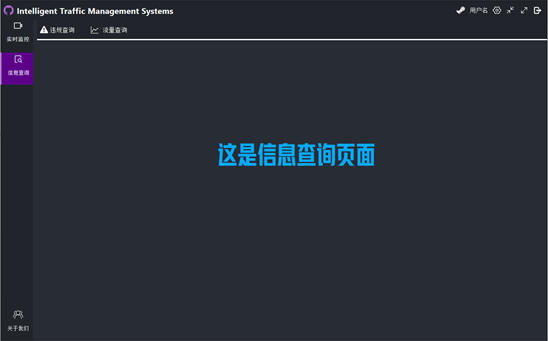
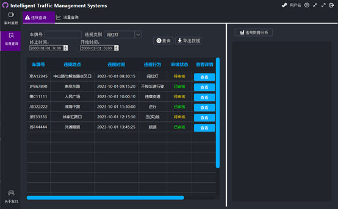

<h1 style="border-bottom: 2px solid #1a5276; padding-bottom: 10px;">智能交通监控管理系统</h1>

<h3 style="color: #2e86c1;">详情设计</h3>

版本：V1.0 | 日期：2025年09月05日

**第一部分 引言**

### 一、编写目的

编写本设计的目的是为了准确阐述智能交通监控系统的具体实现思路和方法，即系统的详细架构和实现逻辑，主要包括程序系统的结构以及各层次中每个程序的设计考虑。预期读者为项目全体成员，包括运行维护和测试人员。

&nbsp;

### 二、项目背景

- 系统名称：智能交通监控系统
- 任务提出者：略
- 开发者：略
- 用户和运行该程序系统的计算中心：略

&nbsp;

### 三、定义

#### **1、技术类**

&nbsp;本系统采用严格的分层架构，各层职责单一，通过接口依赖进行协作，保证代码的清晰性、可维护性和可测试性。

1）controller负责Web层

Web层是系统与用户交互的界面，主要负责接收用户请求、展示处理结果。它是整个系统的流量入口，使用Flask或FastAPI框架的路由视图函数，负责一切与HTTP协议相关的处理，进行参数校验、身份认证、权限校验，但其本身不包含任何核心业务逻辑。

2）service负责业务层管理

通过自定义Service类封装业务逻辑负责核心业务逻辑处理，是系统的核心。它协调多个DAL操作，完成一个完整的业务事务。此处不应有任何HTTP或数据库操作细节。

3）ORM负责持久化层

使用SQLAlchemy或Django的ORM模型，定义与数据库表映射的实体类及其关系。

在python自定义的系统中，对象的调用流程是：Web Request (Flask/FastAPIView)->Controller->Service->Repository->SQLAlchemy ORM Model。数据的流向是：HTTP Request(JSON)->Controller接收并校验数据->封装为DAL->调用Service进行业务处理->Service调用Repository进行持久化操作->数据库。这种架构能让智能交通监控系统的代码职责清晰：Web 层专注接口与交互，业务层处理核心监控逻辑，持久层负责数据存储，便于后续维护和扩展。 

#### **2、业务类**

监控设备终端：安装在道路、路口、停车场等位置的硬件设备，是系统采集数据的基础单元，每个设备具有唯一标识（如设备ID）。

车辆电子标识：车辆安装的电子标签（类似RFID），存储车辆唯一身份信息，支持与路侧设备无线通信（如ETC扩展功能）。

交通事件记录：系统自动识别或人工上报的交通相关事件，是监控系统的核心管理对象，需关联设备、车辆、时间等信息。

&nbsp;

### 四、参考资料

列出有关的参考资料，如：

1.  本项目的经核准的计划任务书或合同、上级机关的批文；
2.  属于本项目的其他已发表的文件；

《需求说明》

《概要设计》

1.  本文件中各处引用到的文件资料，包括所要用到的软件开发标准。

《PEP 8》

&nbsp;

&nbsp;

**第二部分 项目概述**

基于物联网的智能交通监控系统，依托部署于云端的IOT应用，构建车辆、道路设施、监控终端、管理平台、智能传感器、交通信号设备等“物与物”的智慧联动体系。凭借技术创新与模式适配，深度赋能交通管理场景，有效提升交通管控效能、通行效率与服务质量，为城市交通治理、出行服务优化提供数字化支撑，创造显著的社会与经济效益。

系统聚焦路口通行全流程监管，涵盖驶入监测（视频采集、图像抓拍）、通行管控（数据处理、目标识别、行为与车牌识别、车辆追踪）、驶出治理（违规处置、流量调度、信息发布、数据分析、数据管理）三大核心业务环节。具备 7×24小时安全、高效、无故障运行能力，交通管理及运维人员可便捷完成设备状态监控、交通事件处置、业务流程管理，丰富的分析报表满足交通态势研判、执法证据回溯、优化决策等多元需求，助力打造智慧、有序、畅通的交通生态。

&nbsp;

&nbsp;

**第三部分 总体设计**

### 一、技术架构设计

SSH为Struts+Spring+（JPA）Hibernate的组成方式，Struts实现MVC，Spring负责架构的结合，（JPA）Hibernate进行数据的持久化。

这样的结构，满足了一般的业务需要，但是对于当前日益复杂化的WEB2.0的开发，却存在不少问题，归纳起来主要有以下几点的不足：

DAO和服务层容易出现职责不明，由于按照MVC逻辑，业务代码应该写在Struts Action里，但是其事务的提供，却是配置在Service层。为了一组在逻辑上完整的数据操作业务逻辑，需要涉及两个层（Serveice、Action）来进行编写，遇到判断的情况下，为了保证完整的事务操作，则需要将业务代码移到Service层完成，而通常习惯了在Struts Action里调用多次Service而产生多个事务而在出现Exception时导致出错时操作之前调用的Service事务的业务数据没有回滚。

当需要返回的数据供AJAX使用，操作JSON或XML的的大量使用时。开发起来会很费力，一段同样的业务代码，为了使用AJAX和XML可能需要重新编写一次，或者在同一个ACTION里通过标志来判断，对分层结构造成了比较糟糕的破坏。如果设计得不好，为了使用JSON和XML还得额外增加大量的配置，严重降低了开发效率。

因此，为了克服这些缺点，本系统对于SSH架构，进行了重新的分层，共享了业务代码。简化了开发、增强了与AJAX技术、XML技术的结合。提供了一种更高效的开发模式。

其开发的结构图如下：

&nbsp;   由于业务代码统一实现IbusinessService接口，使得只需要相对固定的几个Struts Action类调用Service层的方法，便可以完成工作。包括JSON格式输出，XML输出及WebService输出均调用Service层方法来完成功能。这样便实现了业务代码的分离，以及与前端框架的极大解耦。

### 二、核心控制流程

#### **1、核心控制流程图**

#### **2、核心控制流程说明**

结合上图，针对每一个消息请求，按照消息请求/回复顺序，作如下说明。

|     |     |     |
| --- | --- | --- |
| **编号** | **消息名称** | **消息说明** |
| 1   | HttpServletRequest | 浏览器发来的HttpServletRequest 请求 |
| 2   | ActionForm | 通过ActionForm获取Struts加载的页面表单数据 |
| 3   | Execute | 根据struts-config.xml配置调用指定的Action指定的方法处理请求 |
| 4   | ActionForm.getXxx() | 通过ActionForm获取页面表单数据 |
| 5   | BusinessFactory     .getBusiness | 获得Business对象 |
| 6   | Business Method | 调用业务逻辑 |
| 7   | Import | 使用Pojo进行数据操作 |
| 8   | DAOFactory.getDAO | 获得Dao对象 |
| 9   | Dao Method | 调用Dao方法，执行数据库操作 |
| 10  | Return execution result | 返回Dao执行结果，给Business |
| 11  | Return execution result | 返回Business执行结果，给Action |
| 12  | ActionForward.findForward | Action返回执行结果给新的画面（Struts-Config.xml配置） |
| 13  | HttpServletResponse | MappingDispatchAction返回处理结果给浏览器 |

&nbsp;

### 三、SSH Web环境下的集成配置

#### **1、web.xml**

<?xml version=_"1.0"_ encoding=_"UTF-8"_?>

<web-app version=_"2.5"_ xmlns=_"http://java.sun.com/xml/ns/javaee"_

&nbsp;   xmlns:xsi=_"http://www.w3.org/2001/XMLSchema-instance"_

&nbsp;   xsi:schemaLocation=_"http://java.sun.com/xml/ns/javaee_

&nbsp;   _http://java.sun.com/xml/ns/javaee/web-app_2_5.xsd"_\>

&nbsp;   &lt;!-- web容器预加载springIoc容器 --&gt;

&nbsp;   &lt;context-param&gt;

&nbsp;       &lt;param-name&gt;contextConfigLocation&lt;/param-name&gt;

&nbsp;       &lt;param-value&gt;/WEB-INF/applicationContext.xml&lt;/param-value&gt;

&nbsp;   &lt;/context-param&gt;

&nbsp;   &lt;!-- Spring提供的全局事务 --&gt;

&nbsp;   &lt;listener&gt;

&nbsp;       &lt;listener-class&gt;

&nbsp;           org.springframework.web.context.ContextLoaderListener

&nbsp;       &lt;/listener-class&gt;

&nbsp;   &lt;/listener&gt;

&nbsp;   &lt;!-- Struts2核心控制器 --&gt;

&nbsp;   &lt;filter&gt;

&nbsp;       &lt;filter-name&gt;struts2&lt;/filter-name&gt;

&nbsp;       &lt;filter-class&gt;

&nbsp;            org.apache.struts2.dispatcher.FilterDispatcher

&nbsp;       &lt;/filter-class&gt;

&nbsp;   &lt;/filter&gt;

&nbsp;   &lt;filter-mapping&gt;

&nbsp;       &lt;filter-name&gt;struts2&lt;/filter-name&gt;

&nbsp;       &lt;url-pattern&gt;/\*&lt;/url-pattern&gt;

&nbsp;   &lt;/filter-mapping&gt;

&nbsp;   &lt;welcome-file-list&gt;

&nbsp;       &lt;welcome-file&gt;/global/login.jsp&lt;/welcome-file&gt;

&nbsp;   &lt;/welcome-file-list&gt;

&lt;/web-app&gt;

&nbsp;

&nbsp;

#### **2、struts.xml**

<?xml version=_"1.0"_ encoding=_"UTF-8"_?>

&lt;!DOCTYPE struts PUBLIC "-//Apache Software Foundation//DTD Struts Configuration 2.0//EN" "http://struts.apache.org/dtds/struts-2.0.dtd" &gt;

&lt;struts&gt;

&nbsp;

&lt;/struts&gt;

&nbsp;

&nbsp;

#### **3、persistence.xml**

<?xml version=_"1.0"_ encoding=_"UTF-8"_?>

<persistence version=_"1.0"_

&nbsp;   xmlns=_"http://java.sun.com/xml/ns/persistence"_

&nbsp;   xmlns:xsi=_"http://www.w3.org/2001/XMLSchema-instance"_

&nbsp;   xsi:schemaLocation=_"http://java.sun.com/xml/ns/persistence http://java.sun.com/xml/ns/persistence/persistence_1_0.xsd "_\>

&nbsp;   <persistence-unit name=_"pu"_ transaction-type=_"RESOURCE_LOCAL"_\>

&nbsp;       &lt;provider&gt;org.hibernate.ejb.HibernatePersistence&lt;/provider&gt;

&nbsp;       &lt;properties&gt;

&nbsp;       <property name=_"hibernate.dialect"_ value=_"org.hibernate.dialect.Oracle9Dialect"_/>

&nbsp;            <property name=_"hibernate.show_sql"_ value=_"true"_/>

&nbsp;            <property name=_"hibernate.format_sql"_ value=_"true"_/>

&nbsp;       &lt;/properties&gt;

&nbsp;   &lt;/persistence-unit&gt;

&lt;/persistence&gt;

&nbsp;

&nbsp;

#### **4、applicationContext.xml**

&nbsp;

<?xml version=_"1.0"_ encoding=_"UTF-8"_?>

<beans xmlns=_"http://www.springframework.org/schema/beans"_

&nbsp;   xmlns:tx=_"http://www.springframework.org/schema/tx"_

&nbsp;   xmlns:xsi=_"http://www.w3.org/2001/XMLSchema-instance"_

&nbsp;   xsi:schemaLocation=_"http://www.springframework.org/schema/beans http://www.springframework.org/schema/beans/spring-beans-2.5.xsd http://www.springframework.org/schema/tx http://www.springframework.org/schema/tx/spring-tx-2.5.xsd "_\>

&nbsp;   &lt;!-- 配置访问weblogic的DS --&gt;

&nbsp;   <!--

&nbsp;   &lt;bean id="ds" class="org.springframework.jndi.JndiObjectFactoryBean"&gt;

&nbsp;       &lt;property name="jndiName"&gt;

&nbsp;            &lt;value&gt;jdbcOracle&lt;/value&gt;

&nbsp;       &lt;/property&gt;

&nbsp;       &lt;property name="resourceRef"&gt;

&nbsp;            &lt;value&gt;false&lt;/value&gt;

&nbsp;       &lt;/property&gt;

&nbsp;       &lt;property name="jndiEnvironment"&gt;

&nbsp;            &lt;props&gt;

&nbsp;                &lt;prop key="java.naming.provider.url"&gt;

&nbsp;                    t3://localhost:7001

&nbsp;                &lt;/prop&gt;

&nbsp;                &lt;prop key="java.naming.factory.initial"&gt;

&nbsp;                    weblogic.jndi.WLInitialContextFactory

&nbsp;                &lt;/prop&gt;

&nbsp;            &lt;/props&gt;

&nbsp;       &lt;/property&gt;

&nbsp;   &lt;/bean&gt;

&nbsp;    -->

&nbsp;   &lt;!-- EntityManagerFactory --&gt;

&nbsp;   <bean id=_"entityManagerFactory"_

&nbsp;       class=_"org.springframework.orm.jpa.LocalContainerEntityManagerFactoryBean"_\>

&nbsp;       <property name=_"persistenceUnitName"_ value=_"pu"_/>

&nbsp;       &lt;!-- 访问weblogic中配置的DS --&gt;

&nbsp;       <!--

&nbsp;       &lt;property name="dataSource" ref="ds"/&gt;

&nbsp;        -->

&nbsp;       &lt;!-- 普通连接配置 --&gt;

&nbsp;       <property name=_"dataSource"_\>

&nbsp;            <bean class=_"org.springframework.jdbc.datasource.DriverManagerDataSource"_\>

&nbsp;                <property name=_"driverClassName"_\>

&nbsp;                    &lt;value&gt;oracle.jdbc.driver.OracleDriver&lt;/value&gt;

&nbsp;                &lt;/property&gt;

&nbsp;                <property name=_"url"_\>

&nbsp;                    &lt;value&gt;jdbc:oracle:thin:@127.0.0.1:1521:XE&lt;/value&gt;

&nbsp;                &lt;/property&gt;

&nbsp;                <property name=_"username"_\>

&nbsp;                    &lt;value&gt;system&lt;/value&gt;

&nbsp;                &lt;/property&gt;

&nbsp;                <property name=_"password"_\>

&nbsp;                    &lt;value&gt;yitek&lt;/value&gt;

&nbsp;                &lt;/property&gt;

&nbsp;            &lt;/bean&gt;

&nbsp;       &lt;/property&gt;

&nbsp;   &lt;/bean&gt;

&nbsp;   &lt;!-- JpaTemplate --&gt;

&nbsp;   <bean id=_"jpaTemplate"_ class=_"org.springframework.orm.jpa.JpaTemplate"_\>

&nbsp;       <property name=_"entityManagerFactory"_ ref=_"entityManagerFactory"_/>

&nbsp;   &lt;/bean&gt;

&nbsp;   &lt;!-- JpaTransactionManager --&gt;

&nbsp;   <bean id=_"jpaTxManager"_

&nbsp;       class=_"org.springframework.orm.jpa.JpaTransactionManager"_\>

&nbsp;       <property name=_"entityManagerFactory"_ ref=_"entityManagerFactory"_/>

&nbsp;   &lt;/bean&gt;

&nbsp;   &lt;!-- 将所有具有@Transactional注解的Bean自动配置为声明式事务支持 --&gt;

&nbsp;   <tx:annotation-driven transaction-manager=_"jpaTxManager"_/>

&lt;/beans&gt;

&nbsp;

&nbsp;

&nbsp;

第四部分 界面设计

### 一、界面设计

#### **1、界面框架设计**

#### **2、PC界面设计**

##### **2.1、登录界面设计**

##### **2.2、主体界面设计**

##### **2.3、**实时监控**界面设计**

##### **2.4、信息查询界面设计**

##### **2.5、违规查询界面设计**

##### **2.6、流量查询界面设计**

##### **2.7、关于我们界面设计**

&nbsp;

**第五部分 单元模块设计**

### 一、Model层设计

#### **1、类图设计**

##### **1.1类关系结构图**

##### **1.2时序图**

#### **2、类的详细设计描述**

##### **2.1 User类**

###### **2.1.1 详细描述：**

updatePassword(userId, newPassword)

接收用户ID和新密码，校验后更新密码并返回操作结果

###### **2.1.2 功能实现**

User类作为用户实体模型和数据访问对象，负责用户信息的存储和密码管理：

当AuthController完成用户注册后，创建User实例并持久化到数据库，包含用户ID、用户名和加密密码等核心属性。当用户需要修改密码时，调用updatePassword函数，该函数接收用户ID和新密码参数，先验证用户ID的合法性，然后对新密码进行强度校验和加密处理，最后更新数据库中的密码字段并返回操作成功结果。

##### 2.2 Vehicle类

###### **2.2.1 详细描述：**

|     |
| --- |
| getVehicleInfo(plateNumber)  根据车牌号查询并返回车辆完整信息 |
| updateVehicleInfo(vehicleId, info)  根据车辆ID更新车辆信息，返回操作结果 |

###### **2.2.2 功能实现**

Vehicle类作为车辆实体模型和数据访问对象，负责车辆信息的存储、查询和更新管理：

当vehicleQueryController或MonitorController需要获取或更新车辆信息时，通过Vehicle类提供的函数进行操作。

getVehicleInfo函数接收车牌号参数，从数据库中查询匹配的车辆信息并返回完整的Vehicle对象。

updateVehicleInfo函数接收车辆ID和更新信息，验证数据合法性后执行数据库更新操作。

#####  2.3 Pedestrian类

###### **2.3.1 详细描述：**

getPedestrianInfo(id)

接收行人ID，查询数据库，返回该行人的详细信息

###### **2.3.2 功能实现**

Pedestrian类用于管理行人相关信息：

当外部系统传递行人ID时，调用getPedestrianInfo函数，先校验ID合法性（非负、存在性等），再查询数据库获取行人详细信息，最后返回包含行人数据的对象。

#####   2.4 NonMotorVehicle类

###### **2.4.1 详细描述：**

getNonMotorInfo(id)

接收非机动车ID，查询数据库，返回该非机动车的详细信息

###### **2.4.2 功能实现**

NonMotorVehicle类用于管理非机动车相关信息。当外部系统传递非机动车ID时，调用getNonMotorInfo函数，先校验ID合法性（如非负、存在性等），再查询数据库获取非机动车详细信息，最后返回包含非机动车数据的对象。

#####  2.5 TrafficFlow类

###### **2.5.1 详细描述：**

getTrafficFlowByTime(roadId, time)

接收道路ID和时间参数，查询指定时间段内该道路的交通流量数据，返回流量统计信息

###### **2.5.2 功能实现**

TrafficFlow类用于管理交通流量数据。当传递道路ID和时间参数时，调用getTrafficFlowByTime函数，先校验参数合法性，再查询数据库获取该时间段内的交通流量统计，最后返回流量数据对象。

#####  2.6 Road类

###### **2.6.1 详细描述：**

getCongestionIndex(roadId)

接收道路ID，综合计算该道路的拥堵指数，基于车辆信息、行人信息、非机动车信息等数据

###### **2.6.2 功能实现**

Road类用于管理道路信息和拥堵计算，承担着道路基础设施信息维护和交通状态综合评估的重要职责。该类整合了道路相关的多维度数据，包括交通信号灯配置、各类交通参与者信息（机动车、非机动车、行人）、实时流量数据等。getCongestionIndex函数通过复杂的算法模型，综合车辆密度、行驶速度、行人流量、非机动车数量等多重因素，计算得出0-10范围内的道路拥堵指数。该指数准确反映道路通行效率，为交通指挥中心提供决策依据。

#####  2.7 TrafficLight类

###### **2.7.1 详细描述：**

|     |
| --- |
|     |
|     |
|     |

###### **2.7.2 功能实现**

TrafficLight类用于表示交通信号灯实体，存储信号灯的各种信号状态，提供状态管理和查询功能。

#####  2.8 ViolationEvent类

###### **2.8.1 详细描述：**

|     |
| --- |
| getViolationById(id)  通过违规ID精确查询事件完整信息，支持执法取证和案件处理 |
| updateReviewStatus(id, status)   更新违规事件的审核状态实现审核流程状态流转，确保处理过程可追溯和规范化管理 |

###### **2.8.2 功能实现**

ViolationEvent类是一个抽象类，负责交通违规事件的全程管理，包括违规信息的采集、存储、查询和审核状态维护。该类完整记录违规事件的各项要素：违规唯一标识、发生时间戳、事发道路位置、涉事车辆信息、违规类型分类以及审核处理状态。

getViolationById函数提供精确的违规事件检索功能，确保执法部门能够快速获取违规详情。

updateReviewStatus函数支持审核流程的状态流转，实现从待审核、审核通过到审核拒绝的全流程管理。

#####  2.9 LineCrossingViolation类

###### **2.9.1 详细描述：**

|     |
| --- |
| getViolationById(id)  通过违规ID精确查询事件完整信息，支持执法取证和案件处理 |
| updateReviewStatus(id, status)   更新违规事件的审核状态实现审核流程状态流转，确保处理过程可追溯和规范化管理 |

###### **2.9.2 功能实现**

LineCrossingViolation类继承自ViolationEvent抽象类，定义了交通越线违规事件相关属性，包括违规唯一标识violationId、发生时间戳occurTime、事发道路标识roadId、涉事车辆标识vehicleId、违规类型violationType、审核状态reviewStatus。其getViolationById(id)方法可借违规ID精准查询事件完整信息，辅助执法取证与案件处理；updateReviewStatus(id, status)方法能更新违规事件审核状态。

#####  2.10 RedLightRunningViolation类

###### **2.10.1 详细描述：**

|     |
| --- |
| getViolationById(id)  通过违规ID精确查询事件完整信息，支持执法取证和案件处理 |
| updateReviewStatus(id, status)   更新违规事件的审核状态实现审核流程状态流转，确保处理过程可追溯和规范化管理 |

###### **2.10.2 功能实现**

LineCrossingViolation类继承自ViolationEvent抽象类，定义了闯红灯违规事件相关属性，包括违规唯一标识violationId、发生时间戳occurTime、事发道路标识roadId、涉事车辆标识vehicleId、违规类型violationType、审核状态reviewStatus。其getViolationById (id)方法可借违规ID精准查询事件完整信息，辅助执法取证与案件处理；updateReviewStatus(id, status)方法能更新违规事件审核状态。

#####  2.11 LaneViolation类

##### 

###### **2.11.1 详细描述：**

|     |
| --- |
| getViolationById(id)  通过违规ID精确查询事件完整信息，支持执法取证和案件处理 |
| updateReviewStatus(id, status)   更新违规事件的审核状态实现审核流程状态流转，确保处理过程可追溯和规范化管理 |

###### **2.11.2 功能实现**

LaneViolation类继承自ViolationEvent抽象类，定义了不按规定车道行驶违规事件相关属性，包括违规唯一标识violationId、发生时间戳occurTime、事发道路标识roadId、涉事车辆标识vehicleId、违规类型violationType、审核状态reviewStatus。其getViolationById (id)方法可借违规ID精准查询事件完整信息，辅助执法取证与案件处理；updateReviewStatus(id, status)方法能更新违规事件审核状态。

#####  2.12 IllegalLaneChangeViolation类

###### **2.12.1 详细描述：**

|     |
| --- |
| getViolationById(id)  通过违规ID精确查询事件完整信息，支持执法取证和案件处理 |
| updateReviewStatus(id, status)   更新违规事件的审核状态实现审核流程状态流转，确保处理过程可追溯和规范化管理 |

###### **2.12.2 功能实现**

IllegalLaneChangeViolation类继承自ViolationEvent抽象类，定义了不按规定车道行驶违规事件相关属性，包括违规唯一标识violationId、发生时间戳occurTime、事发道路标识roadId、涉事车辆标识vehicleId、违规类型violationType、审核状态reviewStatus。其getViolationById (id)方法可借违规ID精准查询事件完整信息，辅助执法取证与案件处理；updateReviewStatus(id, status)方法能更新违规事件审核状态。

####  2.13 ReverseDrivingViolation类

###### **2.13.1 详细描述：**

|     |
| --- |
| getViolationById(id)  通过违规ID精确查询事件完整信息，支持执法取证和案件处理 |
| updateReviewStatus(id, status)   更新违规事件的审核状态实现审核流程状态流转，确保处理过程可追溯和规范化管理 |

###### **2.13.2 功能实现**

ReverseDrivingViolation类继承自ViolationEvent抽象类，定义了逆向行驶事件相关属性，包括违规唯一标识violationId、发生时间戳occurTime、事发道路标识roadId、涉事车辆标识vehicleId、违规类型violationType、审核状态reviewStatus。其getViolationById (id)方法可借违规ID精准查询事件完整信息，辅助执法取证与案件处理；updateReviewStatus(id, status)方法能更新违规事件审核状态。

####  2.14 SpeedingViolation类

###### **2.14.1 详细描述：**

|     |
| --- |
| getViolationById(id)  通过违规ID精确查询事件完整信息，支持执法取证和案件处理 |
| updateReviewStatus(id, status)   更新违规事件的审核状态实现审核流程状态流转，确保处理过程可追溯和规范化管理 |

###### **2.14.2 功能实现**

SpeedingViolation类继承自ViolationEvent抽象类，定义了超速违规事件相关属性，包括违规唯一标识violationId、发生时间戳occurTime、事发道路标识roadId、涉事车辆标识vehicleId、违规类型violationType、审核状态reviewStatus。其getViolationById (id)方法可借违规ID精准查询事件完整信息，辅助执法取证与案件处理；updateReviewStatus(id, status)方法能更新违规事件审核状态。

####  2.15 HitAndRunViolation类

###### **2.15.1 详细描述：**

|     |
| --- |
| getViolationById(id)  通过违规ID精确查询事件完整信息，支持执法取证和案件处理 |
| updateReviewStatus(id, status)   更新违规事件的审核状态实现审核流程状态流转，确保处理过程可追溯和规范化管理 |

###### **2.15.2 功能实现**

HitAndRunViolation类继承自ViolationEvent抽象类，定义了肇事逃逸违规事件相关属性，包括违规唯一标识violationId、发生时间戳occurTime、事发道路标识roadId、涉事车辆标识vehicleId、违规类型violationType、审核状态reviewStatus。其getViolationById(id)方法可借违规ID精准查询事件完整信息，辅助执法取证与案件处理；updateReviewStatus(id, status)方法能更新违规事件审核状态。

####  2.16 PedestrianHitViolation类

###### **2.16.1 详细描述：**

|     |
| --- |
| getViolationById(id)  通过违规ID精确查询事件完整信息，支持执法取证和案件处理 |
| updateReviewStatus(id, status)   更新违规事件的审核状态实现审核流程状态流转，确保处理过程可追溯和规范化管理 |

###### **2.16.2 功能实现**

PedestrianHitViolation类继承自ViolationEvent抽象类，定义了肇事伤人相关属性，包括违规唯一标识violationId、发生时间戳occurTime、事发道路标识roadId、涉事车辆标识vehicleId、违规类型violationType、审核状态reviewStatus。其getViolationById (id)方法可借违规ID精准查询事件完整信息，辅助执法取证与案件处理；updateReviewStatus(id, status)方法能更新违规事件审核状态。

### 二、Service层设计

#### **1、类图设计**

##### **1.1类关系结构图**

##### **1.2时序图**

#### **2.类的详细设计描述**

#### 2.1 UserService类

###### **2.1.1 详细描述：**

|     |
| --- |
| createUser(user)  创建新用户账户，接收用户对象参数，完成数据校验后持久化存储到数据库系统 |
| validateLogin(userName, password)  验证用户登录凭证，比对用户名密码匹配性，返回认证结果和用户状态信息 |
| updatePassword(userId, newPassword)  更新用户密码，验证身份后加密存储新密码，确保账户安全性和密码强度合规 |

###### **2.1.2 功能实现**

UserService类负责用户账户的管理，处理用户创建、登录验证和密码更新等核心业务逻辑。

当接收到用户创建请求时，调用createUser函数进行数据完整性校验，确保用户名唯一性和密码复杂度要求，通过后调用数据访问层完成用户信息持久化存储。

在用户登录验证场景中，validateLogin函数比对输入凭证与数据库记录，验证账户状态是否正常，返回包含用户ID和权限的认证结果。

密码更新功能通过updatePassword函数实现，首先验证用户身份合法性，然后对新密码进行加密处理，最终更新数据库记录并返回操作结果。

####  2.2 ViolationService类

###### **2.2.1 详细描述：**

|     |
| --- |
| fetchViolations(condition)  根据查询条件检索违规记录，支持多条件组合筛选，返回分页结果集 |
| getEvidence(violationId)  获取指定违规ID的证据材料，包括图片、视频等多媒体证据文件数据 |
| updateViolationRecord(violationId, data)  更新违规记录信息，支持部分字段修改，记录操作日志备查 |
| reviewViolation(violationId, status)  审核违规记录，更新审核状态并添加审核意见，完成处理流程 |
| addViolation(violationId,data)  添加新的违规记录，接收违规详细信息参数，完成数据校验后入库存储 |

###### **2.2.2 功能实现**

ViolationService类承担交通违规数据的管理职责，提供违规记录的新增、查询、更新和审核等完整业务流程支持。

fetchViolations函数根据传入的查询条件动态构建检索语句，返回符合条件的分页违规数据，支持按时间、地点、类型等多维度筛选。

getEvidence函数通过违规ID关联获取相应的证据材料，包括违规瞬间的图片抓拍和视频录像等多媒体证据。

updateViolationRecord函数允许对已有违规记录进行信息修正。

reviewViolation函数专门处理审核状态流转。

addViolation函数负责接收前端采集的新增违规数据，经过严格校验后持久化存储到数据库系统中。

####  2.3 TrafficFlowService类

###### **2.3.1 详细描述：**

|     |
| --- |
| fetchRealtimeFlow(roadId)  获取道路实时流量数据，包含当前车辆数量、平均速度等实时统计信息 |
| fetchHistoryFlow(roadId, timeRange)  查询历史流量数据，支持按时间范围检索，返回时序流量统计数据 |
| analyzeFlowTrend(roadId)  分析流量变化趋势，识别高峰时段和流量模式，提供趋势预测分析报告 |
| calculateCongestionIndex(roadId)  计算道路拥堵指数，综合多种因素评估道路通行状态，生成拥堵评级 |

###### **2.3.2 功能实现**

TrafficFlowService类负责实时和历史交通流量数据的采集、存储与分析，通过计算拥堵指数和识别流量趋势，为交通管理和道路规划提供数据支撑与决策依据。

fetchRealtimeFlow函数从实时数据源获取当前道路流量信息，包括车辆计数、速度分布等关键指标。

fetchHistoryFlow函数则从历史数据库中检索指定时间范围内的流量数据，支持时序对比分析。

analyzeFlowTrend函数运用统计算法识别流量变化规律和趋势特征，为交通规划提供参考。

calculateCongestionIndex函数综合实时流量、历史数据和道路容量等因素，通过复杂算法计算出客观的拥堵指数，准确反映道路通行状况。

####  2.4 AIAnalysisService类

###### **2.4.1 详细描述：**

|     |
| --- |
| analyzeVideoStream(streamUrl)  分析实时视频流数据，持续处理视频帧并进行交通事件检测分析 |
| detectVehicles(frame)  检测视频帧中的车辆目标，识别车辆位置、大小和类型等视觉特征信息 |
| recognizePlate(frame)  识别车辆牌照信息，提取牌照号码、颜色和地域等关键识别特征数据 |
| detectViolation(frame)  检测交通违规行为，分析车辆运动轨迹并识别各类违规模式特征 |
| sendAlert(event)  发送事件警报通知，将检测到的违规事件实时推送到相关处理人员系统 |

###### **2.4.2 功能实现**

AIAnalysisService类集成了人工智能视觉分析技术，实现对交通场景的智能监控和事件自动识别。

analyzeVideoStream函数持续处理输入的视频流数据，逐帧调用detectVehicles函数进行车辆目标检测，准确识别车辆在画面中的位置和类型特征。

recognizePlate函数进一步提取检测到的车辆目标的牌照信息，完成车辆身份识别。

detectViolation函数通过分析车辆运动轨迹和行为模式，自动识别闯红灯、压线、超速等各种交通违规行为。

一旦发现违规事件，sendAlert函数立即生成警报通知，将事件详细信息实时推送到交通管理平台，实现从视频分析到事件处置的完整闭环处理流程。

### 三、Controller层设计

#### **1.类图设计**

##### **1.1 类关系结构图**

##### **1.2 时序图**

#### **2.类的详细设计描述**

##### **2.1 AuthController类**

###### **2.1.1 详细描述：**

|     |
| --- |
| register(userName, password)  接收View层账号密码，校验后入库并返回注册结果，含用户id |
| login(userName, password)  接收登录请求，校验账号密码与状态，通过则初始化会话并返回结果 |
| logout(userId)  接收登出请求，校验后记录日志、销毁会话，返回结果 |

###### **2.1.2 功能实现**

AuthController类依据View层传来的用户请求，调用自身对应函数完成认证流程：当View层传递注册所需的账号密码时，调用register函数，先校验参数合规性，再完成用户信息入库，最后返回含用户id的注册结果；当接收到登录请求与账号密码参数时，调用login函数，校验账号密码正确性与用户状态，通过后初始化会话并返回登录结果；当View层传递用户id发起登出请求时，调用logout函数，校验请求合法性后记录登出日志、销毁会话，返回登出结果，实现不同认证场景的流程闭环。

##### **2.2 MonitorController类**

###### **2.2.1 详细描述：**

|     |
| --- |
| getRealtimeViolations()  接收View层请求，获取并返回实时交通违规数据。 |
| getRealtimeTrafficFlow()  接收 View 层请求，获取并返回实时交通流量数据。 |
| refreshViolationList()  响应用户刷新操作，重新获取违规数据并更新列表返回。 |
| refreshTrafficFlow()  响应用户刷新操作，重新获取流量数据并更新返回。 |

###### **2.2.2 功能实现**

MonitorController类根据View层不同数据获取、刷新请求，调用对应函数：收到实时违规数据需求，getRealtimeViolations从数据源取数返回；需实时流量数据，getRealtimeTrafficFlow联动服务采集加工回传；用户主动刷新违规列表/流量时，refreshViolationList、refreshTrafficFlow触发数据重获取更新，保障监控数据动态展示。

##### **2.3 ViolationController类**

###### **2.3.1 详细描述：**

|     |
| --- |
| queryByPlate(plateNumber, start, end)  接收车牌、时间范围，查询对应车辆指定时段交通记录并返回。 |
| queryByViolationType(type, start, end)  接收违规类型、时间范围，查询对应类型时段违规记录并返回。 |
| reviewViolation(violationId, decision  接收违规 ID 和审核结果，执行审核流程并更新状态 |
| updateViolation(violationId, newInfo)  接收违规 ID 和更新信息，编辑违规记录并反馈结果。 |
| exportViolationReport(format)  接收报告格式，生成并返回对应格式的违规报表。 |

###### **2.3.2 功能实现**

ViolationController类依据View层发起的不同业务动作（查询、详情查看、审核、编辑、导出），调用对应函数处理：收到带条件的违规查询请求，queryViolations调用违规数据服务，按条件从数据库等数据源筛选数据回传；查看某条违规详情，getViolationDetail调用数据查询逻辑，提取完整违规信息响应；执行违规审核操作时，reviewViolation调用业务流程服务，更新审核状态并反馈结果；需违规记录编辑需求时，updateViolation触发数据更新逻辑，校验并修改违规信息；若导出违规报告，exportViolationReport调用报表生成服务，按指定格式封装数据并返回。

##### **2.4 VehicleQueryController类**

###### **2.4.1详细描述：**

|     |
| --- |
| queryByPlate(plateNumber, start, end)  接收车牌、时间范围，查询对应车辆指定时段交通记录并返回。 |
| queryByViolationType(type, start, end)  接收违规类型、时间范围，查询对应类型时段违规记录并返回。 |

###### **2.4.2功能实现**

VehicleQueryController类依据View层不同车辆及违规查询需求，调用对应函数处理：当收到按车牌号查询的请求，queryByPlate调用数据服务，从数据库等数据源中，按车牌号和时间范围检索匹配记录并回传；若需按违规类型查询，queryByViolationType调用数据筛选逻辑，提取指定违规类型、时间区间内的违规数据响应 。

##### **2.5 TrafficFlowController类**

##### 

###### **2.5.1 详细描述：**

|     |
| --- |
| queryTrafficHistory(roadId, start, end)  接收道路 ID 与时间区间，查询并返回对应道路指定时段的历史交通流量数据。 |
| getTrafficTrend(roadId, range)  接收道路 ID 与时间范围，分析并返回该道路交通流量的变化趋势数据。 |
| getTrafficComparison(roadId, range1, range2)  接收道路 ID 与两个时间范围，对比并返回道路在不同时段的交通流量差异数据。 |
| analyzeTrafficPattern(roadId)  接收道路 ID，挖掘并返回对应道路的交通流量模式与特征。 |
| exportTrafficReport(format)  接收报告格式，生成并返回含流量数据、趋势等内容的交通流量分析报告。 |

###### **2.5.2 功能实现**

TrafficFlowController类依据View层对交通流量的查询、分析、导出等需求，调用对应函数处理：收到历史流量查询，queryTrafficHistory联动数据服务，从存储中按道路和时间筛数据回传；需趋势分析，getTrafficTrend调用分析逻辑，加工流量数据生成趋势结果；做流量对比时，getTrafficComparison提取两时段数据计算差异；执行模式挖掘，analyzeTrafficPattern运用算法识别流量规律；要导出报告，exportTrafficReport协同报表服务，按格式封装内容并返回。

### 四、View层设计

##### 1.界面功能

本系统的 View 层主要负责用户界面展示与交互，涵盖登录、主界面、实时监控、违法查询与审核、统计分析、交通流量等功能。功能模块汇总如下：

|     |     |
| --- | --- |
| 模块名称 | 功能描述 |
| 登录界面 (LoginView) | 用户输入账号和密码，进行登录或注册操作，并反馈登录状态。 |
| 主界面 (MainDashboardView) | 提供菜单栏与状态栏，支持在实时监控、信息查询等模块之间切换。 |
| 实时违法监控 (RealtimeViolationView) | 展示违法行为列表，实时刷新数据，并提供视频监控流播放功能。 |
| 实时交通流量监控 (RealtimeTrafficFlowView) | 显示交通流量图表与拥堵指数，可实时更新。 |
| 违法查询 (ViolationQueryView) | 输入条件查询违法记录，并展示查询结果。 |
| 违法审核 (ViolationReviewView) | 显示违法详情与证据，支持审核通过、驳回、修改操作。 |
| 车牌号查询 (PlateQueryView) | 根据车牌号与时间范围查询相关违法记录。 |
| 违法类型查询 (ViolationTypeQueryView) | 根据违法类型和时间范围查询违法记录。 |
| 违法统计 (ViolationStatisticsView) | 展示违法趋势图、热力图、类型饼图，并支持导出统计报表。 |
| 交通流量查询 (TrafficFlowQueryView) | 根据时间范围查询交通流量数据并展示结果。 |
| 交通流量统计 (TrafficFlowStatisticsView) | 展示交通流量的趋势、占比、对比等图表，支持模式分析与导出报表。 |

##### 2.类图设计

##### **2.1 类关系结构图**

##### **2.2 时序图**

##### 3.类的详细设计描述

##### 3.1.LoginView类

|     |
| --- |
| initUI()  初始化登录界面，加载输入框、按钮和状态提示控件。 |
| onLoginClicked()  处理登录按钮点击事件，获取用户输入并触发登录逻辑。 |
| onRegisterClicked()  处理注册按钮点击事件，跳转到注册逻辑。 |
| showMessage(msg)  接收提示信息并显示在状态栏上。 |

##### 3.2 MainDashboardView类

|     |
| --- |
| initUI()  初始化主界面，加载菜单栏、状态栏及面板。 |
| switchToMonitorView()  切换到实时监控界面。 |
| switchToQueryView()  切换到信息查询界面。 |

##### 3.3 RealtimeViolationView类

|     |
| --- |
| showViolationList(data)  接收违法数据并填充到违法表格中。 |
| refreshViolationList()  刷新违法表格，更新最新的违法信息。 |
| showViolationVideo(stream)  播放违法行为对应的视频流。 |

##### 3.4 RealtimeTrafficFlowView类

|     |
| --- |
| showFlowData(data)  接收并展示实时交通流量数据。 |
| updateCongestionIndex(value)  更新并显示道路的拥堵指数。 |

##### 3.5 ViolationQueryView类

|     |
| --- |
| onQueryClicked()  触发违法记录查询操作。 |
| showQueryResult(data)  接收查询结果并显示在表格中。 |

##### 3.6 ViolationReviewView类

|     |
| --- |
| showViolationDetail(data)  展示违法详情信息及证据。 |
| onApproveClicked()  审核通过，确认违法记录有效。 |
| onRejectClicked(reason)  驳回违法记录，并记录驳回原因。 |
| onModifyClicked(data)  修改违法记录或证据信息。 |

##### 3.7 PlateQueryView类

|     |
| --- |
| onQueryClicked()  触发车牌号查询操作。 |
| showResult(data)  接收查询结果并展示在结果表格中。 |

##### 3.8 ViolationTypeQueryView类

|     |
| --- |
| onQueryClicked()  触发按违法类型的查询操作。 |
| showResult(data)  接收查询结果并展示在结果表格中。 |

##### 3.9 ViolationStatisticsView类

|     |
| --- |
| showStatistics(data)  接收统计数据并展示趋势图、热力图、饼图等。 |
| exportReport(format)  接收导出格式，生成并导出违法统计报表。 |

##### 3.10 TrafficFlowQueryView类

|     |
| --- |
| onQueryClicked()  触发交通流量查询操作。 |
| showResult(data)  接收查询结果并展示在表格中。 |

##### 3.11 TrafficFlowStatisticsView类

|     |
| --- |
| showStatistics(data)  接收交通流量统计数据并展示趋势图、饼图、柱状图、对比图等。 |
| analyzePattern(data)  分析并挖掘交通流量模式与规律。 |
| exportReport(format)  接收导出格式，生成并导出流量统计报表。 |

# 第六部分 数据库设计

### 一、数据库整体结构图

&nbsp;

### 二、系统管理

系统管理ER图

系统管理表格清单

|     |     |     |
| --- | --- | --- |
| 序号  | 表名  | 注释  |
| 1   | WMS_T_DB_NEATEN | 数据库维护记录 |
| 2   | WMS_T_ENUM_D | 枚举数据值 |
| 3   | WMS_T_ENUM_T | 枚举数据类型 |
| 4   | WMS_T_GROUP | 用户组 |
| 5   | WMS_T_PERM_GROUP | 用户组权限分配表 |
| 6   | WMS_T_PERMISSION | 系统权限 |
| 7   | WMS_T_U_G | 用户-用户组关系表 |
| 8   | WMS_T_USER | 系统用户 |

&nbsp;

#### **1、WMS_T_DB_NEATEN表结构**

|     |     |     |     |
| --- | --- | --- | --- |
| 序号  | 列名  | 数据类型 | 注释  |
| 1   | dnID | VARCHAR(16) | 记录编号 |
| 2   | userID | VARCHAR(16) | 维护员编号 |
| 3   | dnTime | DATE | 维护时间 |
| 4   | dnNote | NVARCHAR2(512) | 备注  |
| 5   | dnPath | NVARCHAR2(200) | 备份文件路径 |
| 6   | dnState | VARCHAR(16) | 备份状态 |

&nbsp;

#### **2、WMS_T_ENUM_D表结构**

|     |     |     |     |
| --- | --- | --- | --- |
| 序号  | 列名  | 数据类型 | 注释  |
| 1   | enumdCode | VARCHAR(16) | 枚举值编码 |
| 2   | enumtCode | VARCHAR(16) | 枚举类型编码 |
| 3   | enumdName | NVARCHAR2(60) | 枚举值 |
| 4   | enumdNote | NVARCHAR2(200) | 枚举值描述 |
| 5   | enumdSeq | INTEGER | 页面显示顺序 |
| 6   | enumdEditTime | DATE | 最后编辑时间 |
| 7   | enumdIsDel | SMALLINT | 是否已被删除 |

&nbsp;

#### **3、WMS_T_ENUM_T表结构**

|     |     |     |     |
| --- | --- | --- | --- |
| 序号  | 列名  | 数据类型 | 注释  |
| 1   | enumtCode | VARCHAR(16) | 枚举类型编码 |
| 2   | enumtName | NVARCHAR2(60) | 枚举类型名称 |
| 3   | enumtNote | NVARCHAR2(200) | 枚举类型描述 |
| 4   | enumtSeq | INTEGER | 显示顺序 |
| 5   | enumtEditable | SMALLINT | 用户是否可增减枚举值 |
| 6   | enumtEditTime | DATE | 最后编辑时间 |
| 7   | enumtIsDel | SMALLINT | 是否已被删除 |

&nbsp;

#### **4、WMS_T_GROUP表结构**

|     |     |     |     |
| --- | --- | --- | --- |
| 序号  | 列名  | 数据类型 | 注释  |
| 1   | groupID | VARCHAR(16) | 用户组编号 |
| 2   | groupName | NVARCHAR2(60) | 用户组名称 |
| 3   | groupNote | NVARCHAR2(200) | 描述  |
| 4   | groupEditTime | DATE | 最后编辑日期 |
| 5   | groupIsDel | SMALLINT | 是否已被删除 |

&nbsp;

#### **5、WMS_T_PERM_GROUP表结构**

|     |     |     |     |
| --- | --- | --- | --- |
| 序号  | 列名  | 数据类型 | 注释  |
| 1   | pgID | VARCHAR(16) | 编号  |
| 2   | groupID | VARCHAR(16) | 用户编号 |
| 3   | permID | VARCHAR(16) | 权限编号 |
| 4   | pgDate | DATE | 分配时间 |

&nbsp;

#### **6、WMS_T_PERMISSION表结构**

|     |     |     |     |
| --- | --- | --- | --- |
| 序号  | 列名  | 数据类型 | 注释  |
| 1   | permID | VARCHAR(16) | 权限编号 |
| 2   | permName | NVARCHAR2(60) | 功能名称 |
| 3   | permNote | NVARCHAR2(512) | 描述  |
| 4   | parentPermID | VARCHAR(16) | 父级功能 |
| 5   | permLimitWay | VARCHAR(16) | 限制方式 |
| 6   | permEditTime | DATE | 最后编辑日期 |
| 7  8 | permIsDel  engName | SMALLINT  NVARCHAR2(60) | 是否已被删除  权限英文名称 |

&nbsp;

#### **7、WMS_T_U_G表结构**

|     |     |     |     |
| --- | --- | --- | --- |
| 序号  | 列名  | 数据类型 | 注释  |
| 1   | ugID | VARCHAR(16) | 编号  |
| 2   | ugGroupId | VARCHAR(16) | 用户组编号 |
| 3   | ugUserId | VARCHAR(16) | 用户编号 |
| 4   | ugDate | DATE | 关系建立时间 |

&nbsp;

#### **8、WMS_T_USER表结构**

|     |     |     |     |
| --- | --- | --- | --- |
| 序号  | 列名  | 数据类型 | 注释  |
| 1   | userID | VARCHAR(16) | 用户编号 |
| 2   | userName | NVARCHAR2(60) | 用户姓名 |
| 3   | userAccount | NVARCHAR2(60) | 登录帐号 |
| 4   | userPwd | NVARCHAR2(60) | 登录密码 |
| 5   | userType | VARCHAR(16) | 用户类型 |
| 6   | userSex | VARCHAR(16) | 性别  |
| 7   | userNote | NVARCHAR2(512) | 备注  |
| 8   | userEditTime | DATE | 最后修改日期 |
| 9   | userIsDel | SMALLINT | 是否已被删除 |

&nbsp;

#### **9、系统管理外键清单**

|     |     |     |     |     |     |     |
| --- | --- | --- | --- | --- | --- | --- |
| 外键名称 | 父表  | 父键列 | 子表  | 外键列 | 关系  | 说明  |
| FK_WMS_T_U_\_REFERENCE_WMS_T_GR | WMS_T_GROUP | groupID | WMS_T_U_G | ugGroupId | 0..\* | 一个用户可属于多个用户组，一个用户组下可有多个用户 |
| FK_WMS_T_EN_REFERENCE_WMS_T_EN | WMS_T_ENUM_T | enumtCode | WMS_T_ENUM_D | enumtCode | 1..\* | 一个枚举类型下有多个枚举值(一个枚举值只属于一种类型) |
| FK_WMS_T_DB_REFERENCE_WMS_T_US | WMS_T_USER | userID | WMS_T_DB_NEATEN | userID | 1..\* | 一个用户可进行多次数据库维护(一次数据库维护仅由一个用户完成) |
| FK_WMS_T_PE_REFERENCE_WMS_T_GR | WMS_T_GROUP | groupID | WMS_T_PERM_GROUP | groupID | 0..\* | 一个用户组可拥有多个权限，一个权限可分配给多个用户组 |
| FK_WMS_T_PE_REFERENCE_WMS_T_PE | WMS_T_PERMISSION | permID | WMS_T_PERM_GROUP | permID | 0..\* | 一个用户组可拥有多个权限，一个权限可分配给多个用户组 |
| FK_WMS_T_U_\_WMS_USER_\_WMS_T_US | WMS_T_USER | userID | WMS_T_U_G | ugUserId | 0..\* | 一个用户可属于多个用户组，一个用户组下可有多个用户 |

&nbsp;

&nbsp;

&nbsp;

### 三、客户管理

客户管理ER图

&nbsp;

客户管理表格清单

|     |     |     |
| --- | --- | --- |
| 序号  | 名称  | 注释  |
| 1   | WMS_T_CUSTOMER | 货主  |

&nbsp;

#### **1、WMS_T_CUSTOMER表结构**

|     |     |     |     |
| --- | --- | --- | --- |
| 序号  | 列名  | 数据类型 | 注释  |
| 1   | custID | VARCHAR(16) | 货主编号 |
| 2   | custName | NVARCHAR2(60) | 货主名称 |
| 3   | custIC | VARCHAR(16) | IC卡号 |
| 4   | custICChip | NVARCHAR2(60) | IC卡硬件编号 |
| 5   | custTel | NVARCHAR2(60) | 固话号码 |
| 6   | custMobile | NVARCHAR2(60) | 手机号码 |
| 7   | custSex | VARCHAR(16) | 性别  |
| 8   | custNote | NVARCHAR2(512) | 备注  |
| 9   | custEditTime | DATE | 最后编辑时间 |
| 10  | custIsDel | SMALLINT | 是否已被删除 |

&nbsp;

### 四、业务管理(入库/出库)

业务管理ER图

&nbsp;

业务管理表格清单

|     |     |     |
| --- | --- | --- |
| _序号_ | _名称_ | _注释_ |
| 1   | WMS_T_BILL | 业务单 |
| 2   | WMS_T_BILL_DETAILS | 业务单明细 |

&nbsp;

#### **1、WMS_T_BILL表结构**

|     |     |     |     |
| --- | --- | --- | --- |
| 序号  | 列名  | 数据类型 | 注释  |
| 1   | billID | VARCHAR(16) | 业务单系统编号 |
| 2   | billTransactor | VARCHAR(16) | 结算员编号 |
| 3   | customerID | VARCHAR(16) | 货主编号 |
| 4   | billFeeItem | VARCHAR(16) | 业务类型 |
| 5   | billState | VARCHAR(16) | 单据状态 |
| 6   | billDate | DATE | 业务发生时间 |
| 7   | billCode | NCHAR(13) | 单据可视编号 |
| 8   | billType | VARCHAR(16) | 业务类型 |
| 9   | billNote | NVARCHAR2(512) | 备注  |
| 10  | billAdviceSite | NVARCHAR2(60) | 推荐仓位(精确到库区) |
| 11  | billFeeTruckage | NUMBER(30,2) | 力资费 |
| 12  | billFeeStore | NUMBER(30,2) | 库存费 |
| 13  | billFeeOther | NUMBER(30,2) | 其他费用 |
| 14  | billPayable | NUMBER(30,2) | 应付款 |
| 15  | billPaid | NUMBER(30,2) | 实收款 |
| 16  | billEditTime | DATE | 最后编辑时间 |
| 17  | billIsDel | SMALLINT | 是否已被删除 |

&nbsp;

#### **2、WMS_T_BILL_DETAILS表结构**

|     |     |     |     |
| --- | --- | --- | --- |
| 序号  | 列名  | 数据类型 | 注释  |
| 1   | detailsID | VARCHAR(16) | 明细编号 |
| 2   | billID | VARCHAR(16) | 业务单系统编号 |
| 3   | trayID | VARCHAR(16) | 托盘系统编号 |
| 4   | detailsAffirmant | VARCHAR(16) | 验货员编号 |
| 5   | detailsConservator | VARCHAR(16) | 仓管员编号 |
| 6   | detailsGoodsName | NVARCHAR2(60) | 货物名称 |
| 7   | detailsEstiTotal | INTEGER | 大致总件数 |
| 8   | detailsGoodsNum | INTEGER | 入库/出库货物件数 |
| 9   | detailsGoodsSpec | NUMBER(30,2) | 货物规格(公斤/件) |
| 10  | currentGoodsNum | INTEGER | 当前货物件数 |
| 11  | detailsEditTime | DATE | 最后编辑时间 |
| 12  | detailsIsDel | SMALLINT | 是否已被删除 |

&nbsp;

#### **3、业务管理外键清单**

|     |     |     |     |     |     |     |
| --- | --- | --- | --- | --- | --- | --- |
| 外键名称 | 父表  | 父键列 | 子表  | 外键列 | 关系  | 说明  |
| FK_WMS_T_BI_REFERENCE_WMS_T_TR | WMS_T_TRAY (Shortcut) | trayID | WMS_T_BILL_DETAILS | trayID | 1..\* | 一个托盘可反复利用(一个入库单明细代表一个托盘上存放的货物) |
| FK_WMS_T_BI_REFERENCE_WMS_T_US | WMS_T_USER (Shortcut) | userID | WMS_T_BILL | billTransactor | 1..\* | 一个结算员可办理多个业务单(一个业务单只由一个结算员办理) |
| FK_WMS_T_BI_REFERENCE_WMS_T_CU | WMS_T_CUSTOMER (Shortcut) | custID | WMS_T_BILL | customerID | 1..\* | 一个货主有多个业务单(一个业务单只处理一个货主的业务) |
| FK_BID_REFERENCE_US_CON | WMS_T_USER (Shortcut) | userID | WMS_T_BILL_DETAILS | detailsAffirmant | 1..\* | 一个验货员可进行多次托盘入库/出库验货(一个托盘的入库/出库验货仅涉及一个验货员) |
| FK_BID_REFERENCE_US_AFF | WMS_T_USER (Shortcut) | userID | WMS_T_BILL_DETAILS | detailsConservator | 1..\* | 一个仓管员可进行多次托盘入库/出库(一个托盘的入库/出库操作仅涉及一个仓管员) |
| FK_WMS_T_BI_REFERENCE_WMS_T_BI | WMS_T_BILL | billID | WMS_T_BILL_DETAILS | billID | 1..\* | 一个业务单包含多条业务单明细 |

&nbsp;

&nbsp;

### 五、过户管理

过户管理ER图

&nbsp;

过户管理表格清单

|     |     |     |
| --- | --- | --- |
| _序号_ | _名称_ | _注释_ |
| 1   | WMS_T_TRANS_DETAILS | 过户单明细 |
| 2   | WMS_T_TRANSFER | 过户单 |

&nbsp;

#### **1、WMS_T_TRANSFER表结构**

|     |     |     |     |
| --- | --- | --- | --- |
| 序号  | 列名  | 数据类型 | 注释  |
| 1   | transferID | VARCHAR(16) | 过户单系统编号 |
| 2   | userID | VARCHAR(16) | 操作员编号 |
| 3   | transferVender | VARCHAR(16) | 卖方  |
| 4   | transferBuyer | VARCHAR(16) | 买方  |
| 5   | transferCode | NCHAR(13) | 过户单可视编号 |
| 6   | transferDate | DATE | 过户时间 |
| 7   | transferState | VARCHAR(16) | 过户单状态 |
| 8   | transferNote | NVARCHAR2(512) | 备注  |
| 9   | transferEditTime | DATE | 最后编辑时间 |
| 10  | transferIsDel | SMALLINT | 是否已被删除 |

&nbsp;

#### **2、WMS_T_TRANS_DETAILS表结构**

|     |     |     |     |
| --- | --- | --- | --- |
| 序号  | 代码  | 数据类型 | 注释  |
| 1   | tdetailsID | VARCHAR(16) | 过户单明细编号 |
| 2   | transferID | VARCHAR(16) | 过户单系统编号 |
| 3   | detailsID | VARCHAR(16) | 业务单明细编号 |
| 4   | tdetailsGoodsNum | INTEGER | 过户货物件数 |
| 5   | tdetailsEditTime | DATE | 最后编辑时间 |
| 6   | tdetailsIsDel | SMALLINT | 是否已被删除 |

&nbsp;

#### **3、过户管理外键清单**

|     |     |     |     |     |     |     |
| --- | --- | --- | --- | --- | --- | --- |
| 外键名称 | 父表  | 父键列 | 子表  | 外键列 | 关系  | 说明  |
| FK_TR_REFERENCE_CU_VENDER | WMS_T_CUSTOMER (Shortcut) | custID | WMS_T_TRANSFER | transferVender | 1..\* | 一个货主可多次卖货(一次过户仅有一个卖方) |
| FK_TR_REFERENCE_CU_BUYER | WMS_T_CUSTOMER (Shortcut) | custID | WMS_T_TRANSFER | transferBuyer | 1..\* | 一个货主可多次买货(一次过户仅有一个买方) |
| FK_WMS_T_TR_REFERENCE_WMS_T_BI | WMS_T_BILL_DETAILS (Shortcut) | detailsID | WMS_T_TRANS_DETAILS | detailsID | 0..\* | 一条过户单明细对应一条入库单明细(库存明细) |
| FK_WMS_T_TR_REFERENCE_WMS_T_US | WMS_T_USER (Shortcut) | userID | WMS_T_TRANSFER | userID | 1..\* | 一个结算员可办理多个过户业务(一个过户业务仅由一个结算员办理) |
| FK_WMS_T_TR_REFERENCE_WMS_T_TR | WMS_T_TRANSFER | transferID | WMS_T_TRANS_DETAILS | transferID | 1..\* | 一张过户单可包含多条过户单明细 |

&nbsp;

### 六、调仓管理

调仓管理ER图

&nbsp;

调仓管理表格清单

|     |     |     |
| --- | --- | --- |
| _序号_ | _名称_ | _注释_ |
| 1   | WMS_T_MOVEMENT | 调仓记录 |

&nbsp;

#### **1、WMS_T_MOVEMENT表结构**

|     |     |     |     |
| --- | --- | --- | --- |
| 序号  | 代码  | 数据类型 | 注释  |
| 1   | mgID | VARCHAR(16) | 记录编号 |
| 2   | userID | VARCHAR(16) | 仓管员编号 |
| 3   | detailsID | VARCHAR(16) | 业务单明细编号 |
| 4   | mgType | VARCHAR(16) | 调仓类型 |
| 5   | mgSource | VARCHAR(16) | 源盘/原仓位 |
| 6   | mgDestination | VARCHAR(16) | 目标盘/仓位 |
| 7   | mgNum | INTEGER | 移动货物件数 |
| 8   | mgEditTime | DATE | 记录日期 |
| 9   | mgIsDel | SMALLINT | 是否已被删除 |

&nbsp;

#### **2、调仓管理外键清单**

|     |     |     |     |     |     |     |
| --- | --- | --- | --- | --- | --- | --- |
| 外键名称 | 父表  | 父键列 | 子表  | 外键列 | 关系  | 说明  |
| FK_WMS_T_MO_REFERENCE_WMS_T_US | WMS_T_USER (Shortcut) | userID | WMS_T_MOVEMENT | userID | 1..\* | 一个仓管员可进行多次调仓(一次调仓仅由一个仓管员完成) |
| FK_WMS_T_MO_REFERENCE_WMS_T_BI | WMS_T_BILL_DETAILS (Shortcut) | detailsID | WMS_T_MOVEMENT | detailsID | 1..\* | 一笔业务单明细可进行多次调仓(一次调仓仅对一笔业务单明细中的货物或托盘操作) |

&nbsp;

### 七、盘点管理

盘点管理ER图

&nbsp;

盘点管理表格清单

|     |     |     |
| --- | --- | --- |
| _序号_ | _名称_ | _注释_ |
| 1   | WMS_T_CHECKREPORT | 盘点报告 |
| 2   | WMS_T_CR_DETAILS | 盘点报告明细 |

&nbsp;

#### **1、WMS_T_CHECKREPORT表结构**

|     |     |     |     |
| --- | --- | --- | --- |
| 序号  | 列名  | 数据类型 | 注释  |
| 1   | chkrptID | VARCHAR(16) | 报告编号 |
| 2   | custID | VARCHAR(16) | 货主编号 |
| 3   | chkrptDate | DATE | 报告时间 |
| 4   | chkrptNote | NVARCHAR2(512) | 备注  |
| 5   | chkrptEditTime | DATE | 最后编辑时间 |
| 6   | chkrptIsDel | SMALLINT | 是否已被删除 |

&nbsp;

#### **2、WMS_T_CR_DETAILS表结构**

|     |     |     |     |
| --- | --- | --- | --- |
| 序号  | 代码  | 数据类型 | 注释  |
| 1   | detailsID | VARCHAR(16) | 盘点报告明细编号 |
| 2   | chkrptID | VARCHAR(16) | 盘点报告编号 |
| 3   | detailsGoodsName | NVARCHAR2(100) | 货物名称 |
| 4   | detailsSpec | NUMBER(30,2) | 货物规格 |
| 5   | detailsLastStock | INTEGER | 最近库存 |
| 6   | detailsInput | INTEGER | 入库件数 |
| 7   | detailsOutput | INTEGER | 出库件数 |
| 8   | detailCurrent | INTEGER | 当前库存 |
| 9   | detailsEditTime | DATE | 记录时间 |
| 10  | detailsIsDel | SMALLINT | 是否已被删除 |

&nbsp;

#### **3、盘点管理外键清单**

|     |     |     |     |     |     |     |
| --- | --- | --- | --- | --- | --- | --- |
| 外键名称 | 父表  | 父键列 | 子表  | 外键列 | 关系  | 说明  |
| FK_WMS_T_CH_REFERENCE_WMS_T_CU | WMS_T_CUSTOMER (Shortcut) | custID | WMS_T_CHECKREPORT | custID | 1..\* | 可对一个货主进行多次盘点(一次盘点仅针对一个货主) |
| FK_WMS_T_CR_REFERENCE_WMS_T_CH | WMS_T_CHECKREPORT | chkrptID | WMS_T_CR_DETAILS | chkrptID | 1..\* | 一分盘点报告包含多条盘点报告明细 |

&nbsp;

&nbsp;

### 八、仓库管理

资产管理ER图

&nbsp;

资产管理表格清单

|     |     |     |
| --- | --- | --- |
| _序号_ | _名称_ | _注释_ |
| 1   | WMS_T_SITE | 仓位  |
| 2   | WMS_T_STORE | 库房  |
| 3   | WMS_T_TRAY | 托盘  |
| 4   | WMS_T_WKSTN | 工作站 |

&nbsp;

#### **1、WMS_T_SITE表结构**

|     |     |     |     |
| --- | --- | --- | --- |
| 序号  | 列名  | 数据类型 | 注释  |
| 1   | siteID | VARCHAR(16) | 仓位编号 |
| 2   | siteCode | NVARCHAR2(60) | 仓位代码 |
| 3   | storeID | VARCHAR(16) | 库房编号 |
| 4   | siteEditTime | DATE | 最后编辑时间 |
| 5   | siteIsDel | SMALLINT | 是否已被删除 |

&nbsp;

#### **2、WMS_T_STORE表结构**

|     |     |     |     |
| --- | --- | --- | --- |
| 序号  | 列名  | 数据类型 | 注释  |
| 1   | storeID | VARCHAR(16) | 库房编号 |
| 2   | storeName | NVARCHAR2(60) | 库房名称 |
| 3   | storeNote | NVARCHAR2(200) | 描述  |
| 4   | storeEditTime | DATE | 最后编辑时间 |
| 5   | storeIsDel | SMALLINT | 是否已被删除 |

&nbsp;

#### **3、WMS_T_TRAY表结构**

|     |     |     |     |
| --- | --- | --- | --- |
| 序号  | 列名  | 数据类型 | 注释  |
| 1   | trayID | VARCHAR(16) | 托盘编号 |
| 2   | siteID | VARCHAR(16) | 所在仓位编号 |
| 3   | trayCode | CHAR(5) | 托盘可视编号 |
| 4   | rfidCode | NVARCHAR2(60) | RFID标签硬件编号 |
| 5   | trayState | VARCHAR(16) | 托盘状态 |
| 6   | trayEditTime | DATE | 最后编辑时间 |
| 7   | trayIsDel | SMALLINT | 是否已被删除 |

&nbsp;

#### **4、WMS_T_WKSTN表结构**

|     |     |     |     |
| --- | --- | --- | --- |
| 序号  | 列名  | 数据类型 | 注释  |
| 1   | wkstnID | VARCHAR(16) | 工作站编号 |
| 2   | storeID | VARCHAR(16) | 库房编号 |
| 3   | wkstnName | NVARCHAR2(60) | 工作站名称 |
| 4   | wkstnDevice | VARCHAR(16) | 设备类型 |
| 5   | wkstnIp | NVARCHAR2(60) | IP地址 |
| 6   | wkstnOp | VARCHAR(16) | 工作站操作员 |
| 7   | wkstnState | VARCHAR(16) | 工作站状态 |
| 8   | wkstnEditTime | DATE | 最后编辑时间 |
| 9   | wkstnIsDel | SMALLINT | 是否已被删除 |

&nbsp;

#### **5、资产管理外键清单**

|     |     |     |     |     |     |     |
| --- | --- | --- | --- | --- | --- | --- |
| 外键名称 | 父表  | 父键列 | 子表  | 外键列 | 关系  | 说明  |
| FK_WMS_T_SI_REFERENCE_WMS_T_ST | WMS_T_STORE | storeID | WMS_T_SITE | storeID | 1..\* | 一个库房包含多个仓位 |
| FK_WMS_T_TR_REFERENCE_WMS_T_SI | WMS_T_SITE | siteID | WMS_T_TRAY | siteID | 1..1 | 一个仓位只放一个托盘，一个托盘只占据一个仓位 |
| FK_WMS_T_WK_REFERENCE_WMS_T_ST | WMS_T_STORE | storeID | WMS_T_WKSTN | storeID | 1..\* | 一个库房可包含多个工作站(一个工作站只隶属于一个库房) |
|     |     |     |     |     |     |     |
| FK_WMS_T_WK_REFERENCE_WMS_T_US | WMS_T_USER (Shortcut) | userID | WMS_T_WKSTN | wkstnOp | 1..1 | 一个员工只能同时在一个工作站工作，一个工作站只有一个员工 |

&nbsp;

&nbsp;

&nbsp;

&nbsp;

&nbsp;

**第七部分 补充设计和说明**

### 一、编译运行环境设计

&lt;?xml version="1.0"?&gt;

&lt;!--创建ant工程，设置默认target --&gt;

&lt;project name="build_project" default="deploy_war" basedir="." &gt;

&nbsp;   &lt;!-- 定义引用的jar文件目录 --&gt;

&nbsp;   &lt;property name="lib.dir" value="WebRoot/WEB-INF/lib"/&gt;

&nbsp;   &lt;!-- 定义编译class文件的目录 --&gt;

&nbsp;   &lt;property name="bin.dir" value="WebRoot/WEB-INF/classes"/&gt;

&nbsp;   &lt;!-- 工程部署目录目录 --&gt;

&nbsp;   &lt;property name="tomcat.dir" value="D:\\yitek\\software\\apache-tomcat-6.0.16\\webapps"/&gt;

&nbsp;   &lt;!-- 定义源文件目录 --&gt;

&nbsp;   &lt;property name="build.src" value="src"/&gt;

&nbsp;   &lt;!-- 定义classpath --&gt;

&nbsp;   &lt;path id="master-classpath"&gt;

&nbsp;       &lt;fileset file="${lib.dir}/\*.jar" /&gt;

&nbsp;   &lt;/path&gt;

&nbsp;  

&nbsp;   &lt;!-- 创建需要的目录，用来保存编译好的jar文件 --&gt;

&nbsp;   &lt;target name="init"&gt;

&nbsp;       &lt;delete dir="dist" deleteonexit="true"/&gt;

&nbsp;       &lt;delete dir="${bin.dir}" deleteonexit="true"/&gt;

&nbsp;       &lt;delete dir="${tomcat.dir}" deleteonexit="true"/&gt;

&nbsp;       &lt;!-- war包存放目录 --&gt;

&nbsp;       &lt;mkdir dir="dist"/&gt;

&nbsp;       &lt;!-- 编译后.class文件的存放目录 --&gt;   

&nbsp;       &lt;mkdir dir="${bin.dir}"/&gt;

&nbsp;   &lt;/target&gt;

&nbsp;   &lt;!-- 编译java的doc文档 --&gt;

&nbsp;   &lt;target name="create_doc"&gt;

&nbsp;       &lt;delete dir="doc/api" deleteonexit="true"/&gt;

&nbsp;     &lt;!-- destdir是javadoc生成的目录位置 --&gt;

&nbsp;     <javadoc destdir="doc/api" encoding="UTF-8"

&nbsp;            docencoding="UTF-8" >

&nbsp;         <!-- dir是你的代码位置，记住是java文件的位置

&nbsp;         而不是class文件的位置，第一次用这个命令容易忽略这点-->

&nbsp;       &lt;packageset dir="${build.src}"/&gt;

&nbsp;       &lt;classpath refid="master-classpath"/&gt;

&nbsp;     &lt;/javadoc&gt;

&nbsp;    &lt;/target&gt;

&nbsp;   &lt;!-- 编译所以的java文件 --&gt;

&nbsp;   &lt;target name="compile" depends="init"&gt;

&nbsp;       <javac srcdir="src"

&nbsp;                destdir="${bin.dir}"

&nbsp;                debug="on" encoding="UTF-8">

&nbsp;                &lt;classpath refid="master-classpath" /&gt;

&nbsp;       &lt;/javac&gt;

&nbsp;       &lt;!-- 编译时候将配置文件同时copy到classes目录中--&gt;

&nbsp;       &lt;copy todir="${bin.dir}"&gt;

&nbsp;          &lt;fileset dir="${build.src}" &gt;

&nbsp;               &lt;include name="\*\*/\*.xml"/&gt;

&nbsp;               &lt;include name="\*\*/\*.properties"/&gt;

&nbsp;            &lt;/fileset&gt;

&nbsp;      &lt;/copy&gt;

&nbsp;   &lt;/target&gt;

&nbsp;   &lt;!-- 打包war文件 --&gt;

&nbsp;   &lt;target name="dist_war" depends="compile"&gt;

&nbsp;       &lt;!-- 删除之前存在的相同的war包，避免冲突 --&gt;

&nbsp;       &lt;delete file="dist/mercury.war" deleteonexit="true"/&gt;

&nbsp;       <war destfile="dist/mercury.war"

&nbsp;            webxml="WebRoot/WEB-INF/web.xml">

&nbsp;            &lt;!-- 所要打包的web应用程序目录 --&gt;

&nbsp;            &lt;fileset dir="WebRoot" excludes="\*\*/web.xml"/&gt;

&nbsp;            &lt;!-- 项目使用的jar包目录 --&gt;

&nbsp;            &lt;lib dir="${lib.dir}"/&gt;

&nbsp;       &lt;/war&gt;

&nbsp;   &lt;/target&gt;

&nbsp;   &lt;!-- 部署项目war包，直接拷贝war包tomcat的webapps目录下就ok了--&gt;

&nbsp;   &lt;target name="deploy_war" depends="dist_war"&gt;

&nbsp;       <copy file="dist/mercury.war"

&nbsp;            todir="${tomcat.dir}"/>

&nbsp;   &lt;/target&gt;

&nbsp;   &lt;target name="dist_jar" depends="compile"&gt;

&nbsp;       <jar destfile="dist/mercury.jar"

&nbsp;            basedir="WebRoot/WEB-INF/classes">

&nbsp;       &lt;/jar&gt;

&nbsp;   &lt;/target&gt;

&lt;/project&gt;

&nbsp;

### 二、包路径与WEB目录结构设计

#### **1、包路径设计**

#### **2、WEB目录结构设计**

&nbsp;

&nbsp;

&nbsp;

&nbsp;