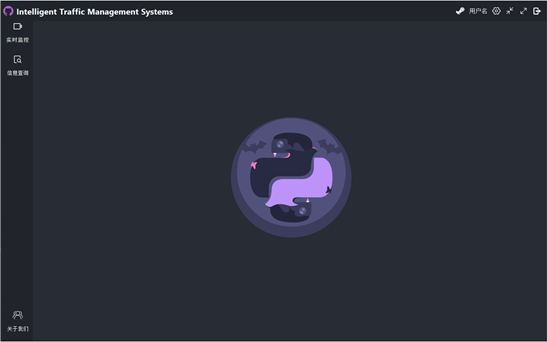

<h1 style="border-bottom: 2px solid #1a5276; padding-bottom: 10px;">智能交通监控管理系统</h1>

<h3 style="color: #2e86c1;">项目需求说明书</h3>

版本：V1.0 | 日期：2025年09月05日

# 第一部分 引言

## 一、说明

编写本说明书的目的是准确阐述《智能交通监控管理系统》项目的具体业务需求、技术需求及需求边界，为项目实施提供清晰指引。本说明书由【智能交通监控管理系统】项目组编写，经【项目经理】负责人确认，读者范围包括项目甲乙双方负责人、开发团队成员、测试团队成员、运维团队成员及其他项目直接干系人。

本说明书是项目实施的核心指导性文件，也是项目最终验收（终验）的关键依据。说明书内容一经甲乙双方确认，将作为项目开展的基础框架。若需对说明书内容进行变更，必须严格遵循项目变更流程：由需求提出方提交书面变更申请，经甲乙双方共同评审通过后，形成书面确认文件，变更内容将作为本说明书的补充部分，在项目实施过程中同步落地。

## 二、定义

### 1.ITS智能交通系统

ITS是智能交通系统（Intelligent Transportation System）的缩写。它通过先进的传感、通信、控制和信息处理技术，对交通流进行实时监测、分析和管理，旨在全面提升交通运输系统的效率、安全性和可持续性。智能交通监控管理系统是其核心组成部分之一。

### 2.CV计算机视觉

CV是计算机视觉（Computer Vision）的缩写，是人工智能的一个分支。它旨在通过计算机和相机来模拟人类视觉系统，实现对图像和视频的自动理解、分析和决策。它是智能交通监控中实现车辆检测、车牌识别和行为分析的核心技术基础。

### 3.CNN卷积神经网络

CNN是卷积神经网络（Convolutional Neural Network）的缩写，是一种专为处理网格状数据（如图像）而设计的深度前馈神经网络。其核心的卷积层和池化层能高效提取图像的局部特征（如边缘、纹理），广泛应用于图像分类、目标检测和车牌识别等任务。

### 4.LPR车牌识别

LPR是车牌识别（License Plate Recognition）的缩写，有时也称为ANPR（自动车牌识别）。它是一种利用计算机视觉和图像处理技术，自动从车辆图像或视频流中检测车牌位置、分割字符并识别出车牌文本的技术。是智能交通系统中进行车辆身份认证的关键环节。

### 5.YOLO目标检测算法

YOLO（You Only Look Once）是一种先进的一阶段（one-stage）目标检测算法。其核心思想是将目标检测任务视为一个单一的回归问题，直接在图像上预测边界框和类别概率。以其极高的处理速度著称，非常适合智能交通监控中对实时性要求极高的场景。

### 6.FPS帧率

FPS是帧率（Frames Per Second）的缩写，表示每秒处理的图像帧数。它是衡量智能交通监控系统实时性能的关键指标。更高的FPS意味着系统能更流畅地处理视频流，减少延迟，从而更及时地捕获交通事件。

### 7.交通事件检测

交通事件检测是指利用智能算法对实时采集的交通视频或图像数据进行分析，自动识别道路上发生的异常事件，包括但不限于交通事故（如车辆碰撞、追尾）、交通违规行为（如闯红灯、逆行、压实线变道、不按导向车道行驶）、道路异常状态（如车辆抛锚、道路障碍物、施工占道）等。当系统检测到异常事件时，会立即触发预警机制——向交通管理后台推送事件类型、发生时间、具体位置、现场图像/视频片段等信息，并可联动电子显示屏向后续车辆发布警示信息，以减少二次事故风险、缩短事件处置响应时间。

### 8.交通流量分析

交通流量分析（Traffic Flow Analysis）是指通过持续检测和统计视频中通过某断面的车辆数量、速度、密度、车型等参数，对交通状况进行量化评估。其分析结果可用于优化信号灯配时、发现交通拥堵点以及为城市规划提供数据支持。

### 9.车辆轨迹跟踪

车辆轨迹跟踪是指在多路口、多监控设备覆盖的区域内，通过匹配车辆的特征信息（如车牌号码、车身颜色、车型、车辆外观独特标识等），将同一车辆在不同时间、不同监控点的抓拍记录进行关联，形成车辆在区域内的连续行驶路径（即轨迹）的技术过程。本系统的轨迹跟踪功能支持对特定车辆（如涉嫌违规、逃逸的车辆）进行跨监控点的实时追踪，可回溯车辆的行驶历史路线，并在电子地图上可视化展示，为交通案件侦查、逃逸车辆追捕提供关键线索。

### 10.视频流处理

视频流处理（Video Stream Processing）是指对来自网络摄像头或视频文件的连续图像序列进行实时解码、分析和提取信息的技术过程。在智能交通监控中，它通常涉及目标检测、跟踪、识别等一系列计算密集型任务，是系统的主要技术挑战之一。

# 第二部分 综述

## 一、项目背景

传统的交通监控管理系统，一般依赖于人工查看监控画面或依靠线圈、雷达等单一传感器来检测交通事件，事后通过人工检索录像来追溯违规车辆。这种方式效率低下、响应迟缓、覆盖面有限，且极易因人员疲劳或疏忽导致漏报、误报，无法满足现代城市对交通实时性、准确性管理的迫切需求。

目前，随着“天网工程”、“雪亮工程”的推进，大多数城市的道路虽已覆盖高清摄像头，但产生的海量视频数据并未得到有效利用。数据的分析和处理仍严重依赖人工，这不仅造成了巨大的存储资源浪费，而且由于人为因素，存在事件发现滞后、取证困难、研判标准不统一等诸多问题。

随着城市机动车保有量的爆炸式增长，交通管理的复杂性和规模已达到前所未有的高度。为了更好地治理交通拥堵、预防交通事故、打击违章行为，交管部门亟需将传统的“被动监控”转变为“主动智能防控”。因此，在现有视频监控网络的基础上，启动基于人工智能与计算机视觉技术的智能交通监控管理系统建设势在必行。

## 二、建设目标

锁定“智能化”和“实战化”目标，利用人工智能与机器视觉技术创新交通管理应用，实现对道路交通的科学管理与智能调度，提升交通运行效率、打击交通违法行为、辅助交通事故处理，立足建设全国领先的智慧交通管理标杆平台。

智能交通监控系统近年来取得了不少进展，湖北民族大学的研究团队提出了一种基于改进轻量化YOLO与几何构建的多车道路口流量统计模型。他们的实验结果表明，该模型车流量统计的准确率达到了92.9%。江西交投万载收费站的“AI鹰眼”系统，对行人、摩托车违规闯入高速公路的行为，从AI系统识别到实时推送预警信息，仅需0.8秒。香港观塘区采用的“智慧交通管理系统”（STMS），能大幅减省95%人手。厦门市在环筼筜湖22个重要路口上线“智能红绿灯”系统后，拥堵指数下降了13.20％。陌讯多模态融合算法中交通违法识别误报率下降78%。智能交通监控系统的这些成效得益于人工智能、大数据、物联网等技术的综合应用，得到了极大发展。

本项目计划将车辆流量统计准确率提升95%，违规行为识别响应时间缩短70%，人工监控人力投入减少60%，交通拥堵时长降低65%，交通违规事件错误判定率控制在0.01%以下，并力争将道路通行满意度提升至85%。通过这些目标的规划与推进，期望为交通管理提供更加科学可靠的技术支撑，逐步实现道路运行效率的提升和公众出行体验的改善，增强交通管理的科学性与可靠性。

## 三、建设原则

### **1.实用有用**

系统建设必须从交警实战业务、指挥中心日常值守和公众出行服务等实际需求出发，建设一个交警能用、好用、愿意用，且能切实提升交通管理效率、减轻工作负荷的实战化系统。

### **2.灵活先进**

系统需具备高度的灵活性和可配置性，能够适应不同路口场景、不断变化的交通规则（如新增的违章类型）以及未来新增的摄像头设备。技术选型上需具备前瞻性，采用主流的深度学习框架和微服务架构，保证系统在3-5年内技术不落后。

### **3.界面友好**

充分考虑指挥中心大屏、桌面工作站、移动警务终端等多种应用场景，提供可视化大屏界面、Web操作界面、移动APP界面等多种人机交互方式。界面设计应直观、简洁，大量采用图表、地图、实时视频等图形化元素展示信息。

### **4.兼容扩展**

系统需整体规划，采用标准协议和接口，能够与现有的电子警察系统、信号控制系统、指挥调度平台、车驾管系统等无缝集成。系统架构必须支持弹性扩展，能够平滑接入未来新增的成千上万路摄像头流。

### **5.安全可靠**

系统必须保证网络、数据、应用和服务的安全，满足公安网信息安全等级保护要求。必须提供7x24小时的高可用性保障，具备完善的日志记录、故障自动检测与告警、数据备份与恢复机制。

## 四、用户业务需求说明

### 1.整体业务需求示意图

### 2.需求详细说明

#### 2.1 驶入路口实时交通监控

1）视频流接入与管理

系统需支持接入不同厂商、不同协议的RTSP/Onvif等标准视频流，并能对摄像头设备进行统一管理（状态监测、PTZ控制等）。

2）图像抓拍与接入

系统需在实时打开的视频流中，持续稳定地读取视频帧，并将这些帧直接用于车辆检测、车牌识别和交通事件判定等后续处理。

系统需提供高分辨率的图片抓拍功能，既可以通过人工操作进行手动触发，也可以在系统自动识别出异常或违规行为时进行事件驱动的自动抓拍。抓拍的图片作为交通执法的有力证据，为后续的核查和处罚提供支撑。

#### 2.2 通过路口的数据处理与识别、追踪

1）视频与图像的数据处理

对从摄像头抓取的每一帧原始图像，系统需进行预处理，提升图像质量，突出关键信息，并统一数据格式，从而显著提高后续模型（车辆检测、车牌识别）的准确性、鲁棒性和处理速度。

针对由于光照变化、天气条件或摄像头本身性能差异带来的图像质量不稳定问题，系统可以通过自动曝光、增强、亮度均衡和色彩校正等方式，确保画面在不同时间和环境下都能保持清晰度和可辨识度，避免因噪点过多或对比度不足而导致目标检测困难，最大限度地还原道路交通环境的真实状态。

在此基础上，系统还可以针对图像中可能存在的模糊、抖动或压缩伪影进行处理，通过去噪、锐化和运动补偿等方法提升画面质量，使得车辆边缘、车牌字符等关键特征更加突出。

针对不同摄像头上传的图像，系统进行统一的数据格式转换和分辨率标准化，确保所有输入数据在格式、尺寸和色彩空间上保持一致，避免因前端设备差异而影响后续模型的推理效率。

2）智能识别检测

系统利用视频分析技术，对接入的视频流进行实时分析，自动进行识别。

目标识别：系统基于卷积神经网络（CNN）模型对画面中的对象进行检测与分类，能够准确区分车辆、行人、非机动车等多种交通参与主体。识别结果实时输出，确保在高流量路口或复杂交通环境下依然保持较高的检测准确率与稳定性。

行为识别：系统能够自动检测各类常见的车辆违章情况与交通事件。车辆违章检测如闯红灯、不按导向车道行驶、压线、逆行、违停、占用公交车道等。交通事件检测如车辆拥堵、排队过长、异常慢行、交通事故（如撞车）、道路遗洒物、行人闯入高速等。

车辆识别：系统需对每一辆经过的车辆进行高精度识别，包括车型、车辆颜色、车牌号码、车牌颜色（蓝、黄、绿、白）等，并将识别结果与车辆经过的时间、地点、车道等信息进行自动关联和存储。这些信息是车辆轨迹分析、执法取证、交通大数据建模的重要基础。

3）车辆轨迹追踪

对于特定车辆（如嫌疑车辆、逃逸车辆）的管控需求，系统需要在常规车辆检测与车牌识别的基础上，进一步实现精准追踪。通过对车牌号码、车身颜色、车型特征以及其他可识别的外观信息进行综合比对，系统能够在多个路口和道路监控点中快速锁定目标车辆的出现位置，并将分散在不同监控设备上的识别结果进行整合，从而构建出该车辆完整的行驶轨迹。

#### 2.3 驶出路口的违章数据处理

1）实时告警与弹窗

一旦检测到事件，系统应在指挥中心大屏和值守席位上通过声光方式进行告警提示，并同步自动弹出现场视频画面。画面中应清晰标注事件类型、具体位置以及相关的时间信息，使值守交警能够在最短时间内获取事件全貌，快速判断事态严重性并采取相应措施。

2）违章证据包生成

对于模型识别的每一条违章记录，系统应自动截取违法过程图片或短视频，生成包含车牌特写、全景照片、违法地点、时间、法律条款等信息的完整证据包。

3）人工审核与复核

考虑到自动识别可能存在的误判情况，系统需要提供一个功能完备、交互友好的Web审核界面，供交警对模型识别的违章记录进行快速浏览、确认或驳回，确保执法准确性。审核界面应支持证据包的完整展示，便于交警在较短时间内核对违法事实，并根据实际情况进行裁定。

#### 2.4 交通数据统计分析

1）交通流量统计

系统应能实时统计各路口、各路段的车辆通过数量、平均车速、车道占有率等数据，并形成日报、周报、月报。统计数据可精准区分小型轿车、货车、公交车等车型，例如在早晚高峰时段，能单独呈现公交车的通行效率，为优化公交专用道规划提供依据。

2）违章数据统计

系统每周和每月自动统计各类违章行为的发生次数、地点、时间分布，为交警部门开展针对性专项整治提供数据支持。统计过程中，不仅能呈现 “闯红灯”“不按导向车道行驶” 等高频违章的基础数据，还能关联违章车辆的品牌型号、使用性质（如私家车、网约车、货运车辆）及车主属地信息，例如可精准分析某区域每周早晚高峰时段，网约车 “不按导向车道行驶” 的违章占比，为区分整治重点车型提供依据。​

统计结果可自动同步至辖区交警中队的工作终端，方便交警提前规划专项整治的时间（如针对早高峰违章高发调整执勤时段）、地点（如在热力图红色预警车道周边设置临时检查点），并搭配违章现场照片、视频片段，让执法人员直观了解违章行为的典型特征，进一步提升整治行动的精准度和效率，减少无效警力投入。

3）数据可视化看板

系统提供综合指挥大屏，以地图、柱状图、折线图、热力图等形式，直观展示全市整体交通运行状态、实时警情分布、拥堵指数、违章高发点等信息。大屏支持多模块联动，例如点击地图上的拥堵路段，可自动弹出该路段的实时监控画面、车流数据及周边警力配置情况，方便指挥中心快速调度。

系统还支持数据穿透查询，指挥中心管理人员点击某类违章的柱状图时，能查看具体违章记录（如车牌、违章时间、现场照片），实现“宏观态势-微观细节”的无缝衔接，提升指挥决策效率。

#### 2.5 系统管理

1）用户与权限管理

系统需提供完善的用户、角色、权限管理功能，可对不同岗位的交警分配不同的数据查看和操作权限。例如，一线执勤交警仅开放实时车辆识别数据查看权限，而指挥中心管理员可拥有用户新增、角色权限配置等更高操作权限，确保权限分配精准匹配岗位职责。

系统还支持权限的动态调整，当交警岗位变动时，管理员能快速更新其权限范围，避免权限冗余或缺失导致的业务风险。

2）布控管理

系统自动将特定车牌号码（如逃逸车辆、嫌疑车辆）加入黑名单布控库。一旦系统监控识别到布控车辆，立即产生最高级别告警，同步推送告警信息至辖区执勤交警的终端设备，并显示车辆实时位置、行驶轨迹等关键数据，助力交警快速布控拦截。

3）日志与审计

系统所有用户操作、模型分析结果、告警信息均具有详细记录，确保每一项操作都可追溯，以满足公安业务规范要求。日志内容须包含操作人、操作时间、操作内容、数据变更前后状态等关键信息，并严格注意隐私安全，对所有敏感信息进行脱敏处理，严禁明文记录用户密码等认证凭据。

系统还需提供高效的多维度日志查询功能，支持按时间范围、操作类型、用户身份等条件进行组合筛选与导出，以全面提升审计工作效率，有效应对上级部门的各项合规检查与安全事件调查。

# 第三部分 需求分析

## 一、用例分析

### 交管部门用例说明：

#### 1.1 用户登录用例描述

|     |     |
| --- | --- |
| ID  | ITS0001 |
| 用例名称 | 用户登录 |
| 父用例ID | \-  |
| 主要执行者 | 交管部门 |
| 前置条件 |     |
| 事件流 | a.打开登录页面，在用户名输入框内输入用户名  b.在密码输入框内输入密码  c.在验证码输入框内输入验证码  d.点击登录按钮登录 |
| 可选事件流 | 无   |
| 异常事件流 | 用户名或密码错误，系统提示“用户名或密码错误，请重新输入” |
| 后置条件 | 无   |

#### 1.2 实时监控查看用例描述

|     |     |
| --- | --- |
| ID  | ITS0002 |
| 用例名称 | 实时监控 |
| 父用例ID | \-  |
| 主要执行者 | 交管部门 |
| 前置条件 | 登陆系统 |
| 事件流 | a.交管部门进入实时监控页面  b.交管部门查看实时流量情况、实时违规事件等 |
| 可选事件流 | 无   |
| 异常事件流 | 视频流中断，该路视频画面显示“信号丢失”提示，并生成设备故障日志 |
| 后置条件 | 无   |

#### 1.3 信息查询用例描述

|     |     |
| --- | --- |
| ID  | ITS0003 |
| 用例名称 | 信息查询 |
| 父用例ID | \-  |
| 主要执行者 | 交管部门 |
| 前置条件 | 登录系统 |
| 事件流 | a.交管部门进入信息查询页面  b.交管部门选择进行的查询操作（违规查询、流量查询） |
| 可选事件流 | 无   |
| 异常事件流 |     |
| 后置条件 | 无   |

#### 1.4 违规查询用例描述

|     |     |
| --- | --- |
| ID  | ITS0004 |
| 用例名称 | 违规查询 |
| 父用例ID | ITS0003（信息查询） |
| 主要执行者 | 交管部门 |
| 前置条件 | 登录系统 |
| 事件流 | a.交管部门在信息查询页面选择违规查询  b.系统根据接收到的条件，从数据库查询匹配的历史违规数据  c.系统将查询到的违规数据以列表的形式在页面上展示给交管部门 |
| 可选事件流 | 无   |
| 异常事件流 |     |
| 后置条件 | 无   |

#### 1.5 违规审核用例描述

|     |     |
| --- | --- |
| ID  | ITS0005 |
| 用例名称 | 违规审核 |
| 父用例ID | ITS0004（违规查询） |
| 主要执行者 | 交管部门 |
| 前置条件 | 进入信息查询-违规查询页面 |
| 事件流 | a.交管部门在违规查询页面选择未审核违规数据  b.系统根据接收到的条件，从数据库查询匹配的未审核违规数据  c.系统将查询到的未审核违规数据以列表的形式在页面上展示给交管部门  d.交管部门选择对未审核违规数据的操作（添加、删除、修改）  e.交管部门选择“审核完成”，系统将该条违规数据标记为“已审核” |
| 可选事件流 | 无   |
| 异常事件流 |     |
| 后置条件 | 无   |

#### 1.6 按车牌查询用例描述

|     |     |
| --- | --- |
| ID  | ITS0006 |
| 用例名称 | 按车牌查询 |
| 父用例ID | ITS0004（违规查询） |
| 主要执行者 | 交管部门 |
| 前置条件 | 进入信息查询-违规查询页面 |
| 事件流 | a.交管部门在违规查询页面选择按车牌查询  b.交管部门输入要查询的完整车牌号  c.系统根据接收到的条件，从数据库查询与该车牌号匹配的历史违规数据  d.系统将查询到的历史违规数据以列表的形式在页面上展示给交管部门 |
| 可选事件流 | 无   |
| 异常事件流 |     |
| 后置条件 | 无   |

#### 1.7 按违规类别查询用例描述

|     |     |
| --- | --- |
| ID  | ITS0007 |
| 用例名称 | 按违规类别查询 |
| 父用例ID | ITS0004（违规查询） |
| 主要执行者 | 交管部门 |
| 前置条件 | 进入信息查询-违规查询页面 |
| 事件流 | a.交管部门在违规查询页面选择按违规类别查询  b.交管部门选择要查询的违规类别（闯红灯、压线等）  c.系统根据接收到的条件，从数据库查询与该违规类别匹配的历史违规数据  d.系统将查询到的历史违规数据以列表的形式在页面上展示给交管部门 |
| 可选事件流 | 无   |
| 异常事件流 |     |
| 后置条件 | 无   |

#### 1.8 违规数据统计分析用例描述

|     |     |
| --- | --- |
| ID  | ITS0008 |
| 用例名称 | 违规数据统计分析 |
| 父用例ID | ITS0004（违规查询） |
| 主要执行者 | 交管部门 |
| 前置条件 | 进入信息查询-违规查询页面 |
| 事件流 | a.交管部门在页面上选择或输入统计参数（如时间范围、违规类型等）  b.系统根据参数查询数据库，执行统计分析（如计算违规次数、趋势、分布等）  c.系统在页面上展示统计结果，包括汇总数据和可视化图表（如表格、柱状图或饼图）。 |
| 可选事件流 | 无   |
| 异常事件流 |     |
| 后置条件 | 无   |

#### 1.9 流量查询用例描述

|     |     |
| --- | --- |
| ID  | ITS0009 |
| 用例名称 | 流量查询 |
| 父用例ID | ITS0003（信息查询） |
| 主要执行者 | 交管部门 |
| 前置条件 | 进入信息查询页面 |
| 事件流 | a.交管部门在信息查询页面选择流量查询  b.系统根据接收到的条件，从数据库查询匹配的历史交通流量数据  c.系统将查询到的流量数据以列表的形式在页面上展示给交管部门 |
| 可选事件流 | 无   |
| 异常事件流 |     |
| 后置条件 | 无   |

#### 1.10 流量数据统计分析用例描述

|     |     |
| --- | --- |
| ID  | ITS0010 |
| 用例名称 | 流量数据统计分析 |
| 父用例ID | ITS0009（流量查询） |
| 主要执行者 | 交管部门 |
| 前置条件 | 进入信息查询-流量查询页面 |
| 事件流 | a.交管部门在信息查询页面选择或输入流量统计条件（如时间范围、特定路口/路段、车辆类型等）  b.系统根据接收到的条件，从数据库查询相关的交通流量数据，并进行计算分析（如计算车流量总数、平均流量、高峰时段流量等）  c.系统将统计分析结果以图表（如折线图、柱状图）和列表的形式在页面上展示给交管部门 |
| 可选事件流 | 无   |
| 异常事件流 |     |
| 后置条件 | 无   |

## 二、界面风格

### **1.登录界面**

### **2.主页面**

### **3.实时监控页面**

### **4.信息查询页面**

### **5.违规查询页面**

### **6.流量查询页面**

### **7.关于我们页面**

# 第四部分 验收标准

## 一、功能范围定义

|     |     |     |     |     |     |     |
| --- | --- | --- | --- | --- | --- | --- |
| #   | 产品  | 模块  | 组件  | 规格/型号 | 角色  | 接入  |
| 1   | 智能交通监控管理系统 | 系统管理单元 | 用户与权限管理模块 | 用户创建与删除、角色定义、权限组分配、密码策略管理 | 管理员 | Web |
| 2   | 布控管理模块 | 布控车辆信息录入（车牌、车型）、布控规则设置（时间、路段） | 交警  | Web |
| 3   | 日志与审计模块 | 用户操作日志记录、系统登录日志查询、日志导出、安全事件审计 | 审计员 | Web |
| 4   | 实时交通监控单元 | 视频采集模块 | 支持RTSP/Onvif协议接入、视频流接入、视频流预览与切换 | 自动系统/监控员 | Web |
| 5   | 图像抓拍模块 | 自动读取视频帧、人工操作抓拍、照片设置（分辨率、格式） | 自动系统 | 后台  |
| 6   | 车辆识别追踪单元 | 图像预处理模块 | 图像去雾去噪、亮度校正、图像裁剪、格式转换 | 自动系统 | 后台  |
| 7   | AI识别检测模块 | 目标识别（车辆、行人、非机动车）、车辆违规行为识别（逆行、压线）、车牌车型识别 | 自动系统 | 后台  |
| 8   | 车辆轨迹追踪模块 | 外观信息对比、车辆时空轨迹分析还原、识别结果整合 | 自动系统 | Web |
| 9   | 数据处理与统计分析单元 | 违规事件告警模块 | 声光信息告警、事件信息生成（类型、位置、时间） | 自动系统 | Web |
| 10  | 违规信息生成模块 | 自动生成违法记录（时间、地点、图片、视频）、合成证据图片、填入法律条文 | 自动系统 | 后台  |
| 11  | 人工审核模块 | 违规信息列表展示、证据图片/视频复核、误报剔除、确认违法并提交 | 交警  | Web |
| 12  | 交通流量统计模块 | 断面车流量统计、平均车速计算、车道占有率分析、生成日报/周报/月报 | 自动系统 | Web |
| 13  | 违规数据统计模块 | 按类型统计违法数量（超速、闯红灯等）、违法高发地点排名、趋势分析图表 | 自动系统 | Web |

## 二、性能指标定义

|     |     |     |     |     |     |
| --- | --- | --- | --- | --- | --- |
| #   | 产品  | 模块  | 组件  | 规格/型号 | 性能级别 |
| 1   | 智能交通监控管理系统 | 系统管理单元 | 用户与权限管理模块 | 用户创建与删除、角色定义、权限组分配、密码策略管理 | B   |
| 2   | 布控管理模块 | 布控车辆信息录入（车牌、车型）、布控规则设置（时间、路段） | A   |
| 3   | 日志与审计模块 | 用户操作日志记录、系统登录日志查询、日志导出、安全事件审计 | A   |
| 4   | 实时交通监控单元 | 视频采集模块 | 支持RTSP协议接入、视频流接入、视频流预览与切换 | A   |
| 5   | 图像抓拍模块 | 自动读取视频帧、人工操作抓拍、照片设置（分辨率、格式） | A   |
| 6   | 车辆识别追踪单元 | 图像预处理模块 | 图像去雾去噪、亮度校正、图像裁剪、格式转换 | A   |
| 7   | 模型识别检测模块 | 目标识别（车辆、行人、非机动车）、车辆违规行为识别（逆行、压线）、车牌车型识别 | A   |
| 8   | 车辆轨迹追踪模块 | 外观信息对比、车辆时空轨迹分析还原、识别结果整合 | A   |
| 9   | 数据处理与统计分析单元 | 违规事件告警模块 | 声光信息告警、事件信息生成（类型、位置、时间） | A   |
| 10  | 违规信息生成模块 | 自动生成违法记录（时间、地点、图片、视频）、合成证据图片、填入法律条文 | A   |
| 11  | 人工审核模块 | 违规信息列表展示、证据图片/视频复核、误报剔除、确认违法并提交 | B   |
| 12  | 交通流量统计模块 | 断面车流量统计、平均车速计算、车道占有率分析、生成日报/周报/月报 | A   |
| 13  | 违规数据统计模块 | 按类型统计违法数量（超速、闯红灯等）、违法高发地点排名、趋势分析图表 | A   |

**说明：**级别（A:表示非常重要必须达到的技术性能要求,B:表示重要推荐达到的技术性能要求,C：表示非重要可以弱化的技术性能要求.）

# 第五部分 环境和部署要求

## 一、网络部署图二、应用部署图三、运行环境说明

### 1.操作系统

服务器端：Linux（Ubuntu Server 20.04 LTS 或 CentOS Stream 9），64 位系统

客户端（管理端）：Windows 10专业版（64 位）或Ubuntu Desktop 22.04 LTS3. 嵌入式采集终端：Linux嵌入式系统（如 Buildroot、Yocto Project）

### 2.开发环境

编程语言环境：Python 3.8-3.10（安装 Anaconda 3 管理依赖）

机器学习框架：PyTorch 1.10-2.0（支持 CUDA 11.3）

机器视觉库：OpenCV 4.5.5-4.8.0（支持 CUDA 加速）

图形界面框架：pyQt5，pyQt5-tools